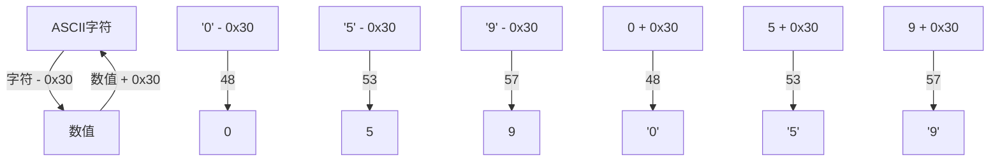
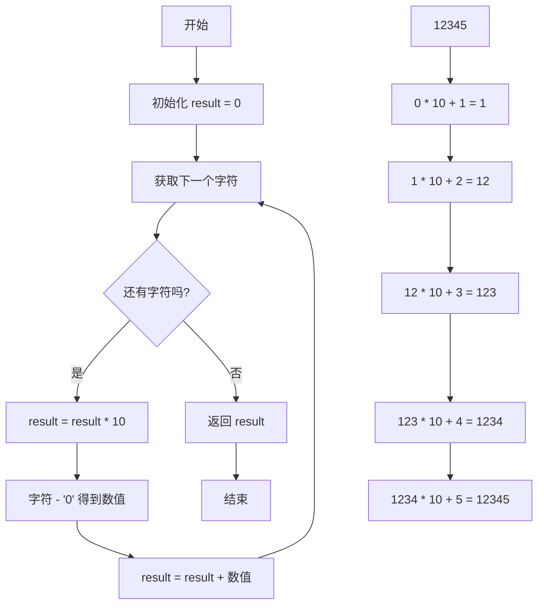
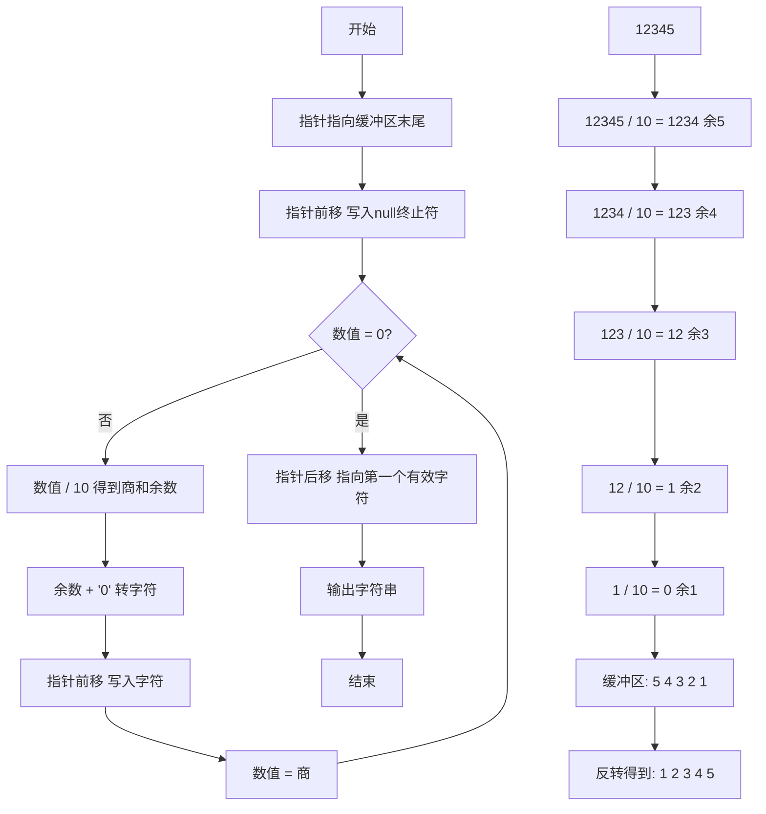
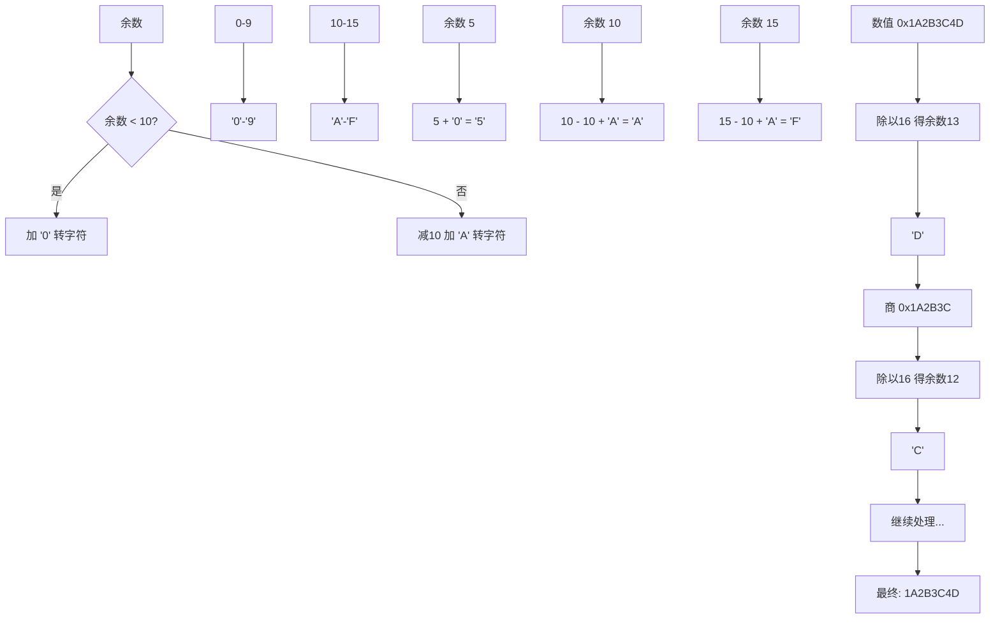
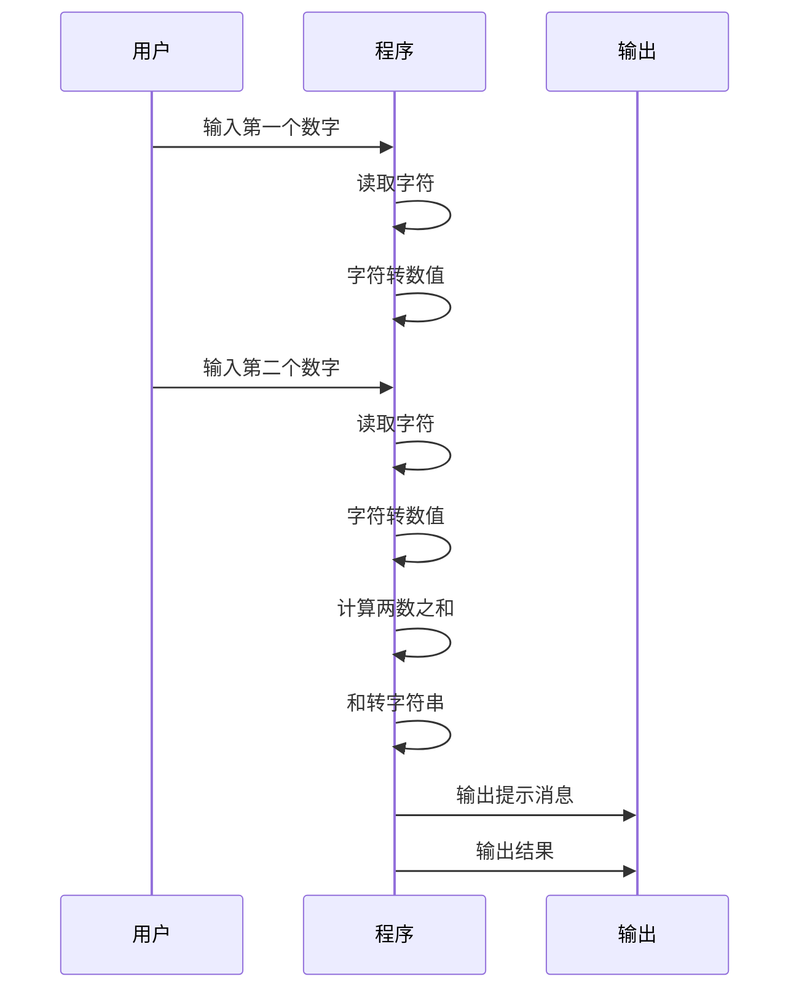
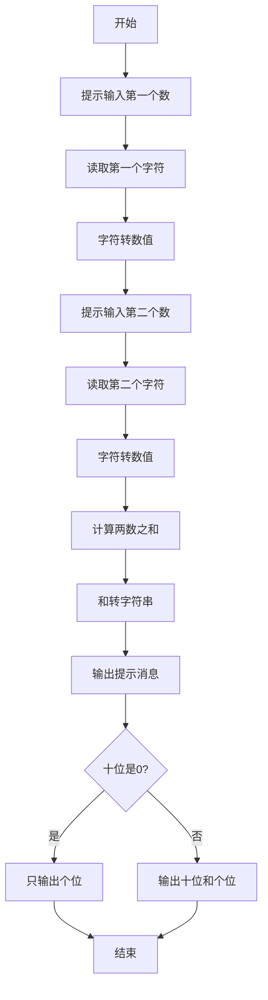

---
title: 汇编语言数字处理
created: 2026-05-17
updated: 2026-05-17
categories: [汇编语言, 数据处理, 基本数据]
categoryPath: "汇编语言/数据处理/基本数据"
tags: [汇编语言, 数字处理, 进制转换, ASCII]
sources: [raw/articles/汇编语言数字处理.md]
confidence: high
diagramized: true
diagramizedAt: 2026-05-17
---

# 汇编语言数字处理

在汇编语言中处理数字涉及到**进制转换**、**ASCII 转换**和**算术运算**的结合。本章详细讲解如何在程序中输入和输出各种进制的数字。

## 概述

### 什么是数字处理？

数字处理是指在计算机程序中对数值进行输入、转换、计算和输出的过程。在汇编语言中，这一过程尤为重要，因为我们需要直接与硬件打交道。

### 为什么需要学习数字处理？

- 所有程序都需要处理数字
- 汇编语言没有内置的数字输入输出函数
- 需要理解底层的字符与数值转换机制
- 这是编写实用汇编程序的基础技能

---

## 数字的表示方式

计算机内部所有数字都以二进制存储，但程序中可以用不同进制表示：

| 进制   | 基数 | NASM 写法                | 数字范围（32位） |
| ---- | -- | ---------------------- | --------- |
| 二进制  | 2  | 0b10101010 或 10101010b | 0 和 1     |
| 八进制  | 8  | 0o52 或 52o             | 0-7       |
| 十进制  | 10 | 42                     | 0-9       |
| 十六进制 | 16 | 0x2A 或 2Ah             | 0-9, A-F  |

### 进制选择原则

- **二进制**：适合位运算和底层硬件操作
- **八进制**：历史遗留，现在较少使用
- **十进制**：人类最熟悉的表示方式，用于日常数值
- **十六进制**：程序员最常用，因为每4位二进制对应1位十六进制，简洁易读

---

## ASCII 与数字的关系

在屏幕上输入和输出的都是 **ASCII 字符**，而非二进制数值。理解字符与数值的转换是汇编数字处理的核心：

| 字符  | ASCII 值  | 对应的数值    |
| --- | -------- | -------- |
| '0' | 0x30（48） | 0        |
| '1' | 0x31（49） | 1        |
| '9' | 0x39（57） | 9        |
| 'A' | 0x41（65） | 10（十六进制） |
| 'F' | 0x46（70） | 15（十六进制） |
| 'a' | 0x61（97） | 10（十六进制） |

### 转换公式

**字符转数字**：
```
数值 = ASCII码 - '0'（即 ASCII码 - 0x30）
```

**数字转字符**：
```
ASCII码 = 数值 + '0'（即 数值 + 0x30）
```

### 转换示例

- 字符 '5' 的 ASCII 码是 0x35，转换为数值：`0x35 - 0x30 = 5`
- 数值 7 转换为字符：`7 + 0x30 = 0x37`，即字符 '7'

### ASCII 与数字转换关系图



---

## 输入数字（字符串转数值）

用户输入的是字符序列，需要转换为二进制数值才能用于计算。

### 转换原理

将字符串 "12345" 转换为数值 12345 的算法：

```
result = 0
对于每个字符：
    result = result * 10 + (当前字符 - '0')
```

### 字符串转数值流程图



### 完整示例

```nasm
; 文件路径：string_to_int.asm
; 将十进制数字字符串转换为整数值

section .data
    input_str   db  '12345', 0     ; 输入字符串 "12345"
    input_len   dd  5               ; 字符串长度

section .bss
    result_val  resd 1              ; 存放转换后的数值

section .text
global _start

_start:
    ; 转换算法：result = 0
    ; result = result * 10 + (当前字符 - '0')
    mov     esi, input_str         ; esi 指向输入字符串
    mov     ecx, [input_len]       ; ecx = 循环次数
    mov     eax, 0                 ; eax = 累加结果

convert_loop:
    mov     ebx, 10
    mul     ebx                    ; eax = eax * 10
                                   ; mul ebx: edx:eax = eax * ebx

    mov     bl, [esi]              ; 读取当前字符
    sub     bl, '0'                ; 转为数值：字符 - '0'
    movzx   ebx, bl                ; 零扩展 ebx（bl -> ebx）
    add     eax, ebx               ; eax = eax + 当前位数值

    inc     esi                    ; 移动到下一个字符
    loop    convert_loop           ; eax 现在 = 12345

    mov     [result_val], eax      ; 保存结果

    mov     eax, 1
    mov     ebx, 0
    int     0x80
```

### 算法解析

以 "12345" 为例：

- 第1轮：`result = 0 × 10 + 1 = 1`
- 第2轮：`result = 1 × 10 + 2 = 12`
- 第3轮：`result = 12 × 10 + 3 = 123`
- 第4轮：`result = 123 × 10 + 4 = 1234`
- 第5轮：`result = 1234 × 10 + 5 = 12345`

最终得到 12345。

---

## 输出数字（数值转字符串）

将二进制数值转为可显示的十进制字符串。

### 转换原理

将数值转换为字符串需要从**最低位**开始处理：

1. 用数值除以 10，得到商和余数
2. 余数是当前最低位的数字
3. 将余数存入缓冲区（从后往前）
4. 用商继续重复上述过程，直到商为 0

### 数值转字符串流程图



### 完整示例

```nasm
; 文件路径：int_to_string.asm
; 将整数值转换为十进制字符串输出

section .data
    number      dd  12345          ; 要输出的数字
    newline     db  0xA

section .bss
    output_buf  resb 12            ; 输出缓冲区（最大 32 位整数是 10 位 + 符号 + null）

section .text
global _start

_start:
    mov     eax, [number]          ; 加载数字
    mov     edi, output_buf + 11   ; edi 指向缓冲区末尾
    mov     byte [edi], 0          ; null 终止符（方便调试）
    dec     edi

    mov     ebx, 10                ; 除数 = 10
    mov     ecx, 0                 ; 位数计数器

convert_digit:
    mov     edx, 0                 ; 清零 edx（div 需要 edx:eax）
    div     ebx                    ; eax = eax/10, edx = eax%10
    add     dl, '0'                ; 余数转字符
    mov     [edi], dl              ; 存入缓冲区（从后往前）
    dec     edi                    ; 缓冲区指针前移
    inc     ecx                    ; 位数 +1
    cmp     eax, 0                 ; 商是否为 0？
    jne     convert_digit          ; 否，继续循环

    ; 现在 edi+1 指向第一个有效数字字符
    inc     edi                    ; 修正指针，指向字符串开头

    ; 计算有效字符长度
    ; output_buf + 11 - edi 即有效长度

    ; 输出数字
    mov     eax, 4
    mov     ebx, 1
    mov     ecx, edi               ; 指向转换后的字符串
    mov     edx, output_buf + 11
    sub     edx, edi               ; edx = 缓冲区末尾 - 字符串开头
    int     0x80

    ; 输出换行
    mov     eax, 4
    mov     ebx, 1
    mov     ecx, newline
    mov     edx, 1
    int     0x80

    mov     eax, 1
    mov     ebx, 0
    int     0x80
```

### 运行结果

```bash
$ nasm -f elf32 int_to_string.asm -o int_to_string.o
$ ld -m elf_i386 int_to_string.o -o int_to_string
$ ./int_to_string
12345
```

---

## 十六进制输入输出

处理十六进制需要同时处理 0-9 和 A-F/a-f 的转换。

### 十六进制转换流程图



### 十六进制输出示例

```nasm
; 文件路径：hex_output.asm
; 将数值以十六进制格式输出

section .data
    number       dd  0x1A2B3C4D    ; 要输出的值
    hex_prefix   db  '0x'
    hex_prefix_len equ $ - hex_prefix
    newline      db  0xA

section .bss
    hex_buf      resb 10           ; 8 个十六进制位 + 前缀 + null

section .text
global _start

_start:
    ; 输出前缀 "0x"
    mov     eax, 4
    mov     ebx, 1
    mov     ecx, hex_prefix
    mov     edx, hex_prefix_len
    int     0x80

    mov     eax, [number]          ; 要转换的数值
    mov     edi, hex_buf + 8       ; 缓冲区末尾（8 个十六进制位）
    mov     ecx, 8                 ; 循环 8 次（32 位 = 8 个十六进制位）

hex_loop:
    mov     edx, 0                 ; 准备除法
    mov     ebx, 16                ; 除以 16
    div     ebx                    ; 现在：eax 除以 ebx
                                   ; 注意：这里 div ebx 实际是 edx:eax / ebx
                                   ; 余数在 edx（0-15），商在 eax
    mov     ebx, eax               ; 保存商

    ; 将余数转为十六进制字符
    mov     al, dl
    cmp     al, 10
    jl      digit_09               ; 0-9
    add     al, 'A' - 10           ; A-F
    jmp     store_char

digit_09:
    add     al, '0'                ; 0-9

store_char:
    dec     edi
    mov     [edi], al
    mov     eax, ebx               ; 恢复商
    loop    hex_loop

    ; 输出十六进制数字（8 位）
    mov     eax, 4
    mov     ebx, 1
    mov     ecx, hex_buf
    mov     edx, 8
    int     0x80

    ; 输出换行
    mov     eax, 4
    mov     ebx, 1
    mov     ecx, newline
    mov     edx, 1
    int     0x80

    mov     eax, 1
    mov     ebx, 0
    int     0x80
```

---

## 完整示例：简单的加法计算器

从键盘输入两个一位数，计算它们的和并输出。

### 计算器工作流程图





### 完整代码

```nasm
; 文件路径：simple_calc.asm
; 输入两个一位数（0-9），计算和并输出

section .data
    prompt1       db  'Enter first number (0-9): '
    prompt1_len   equ $ - prompt1
    prompt2       db  'Enter second number (0-9): '
    prompt2_len   equ $ - prompt2
    result_msg    db  'Sum = '
    result_msg_len equ $ - result_msg
    newline       db  0xA

section .bss
    num1          resb 2           ; 第一个数的输入（1位+换行）
    num2          resb 2           ; 第二个数的输入
    result_str    resb 3           ; 结果字符串（最多2位+换行）

section .text
global _start

_start:
    ; 提示输入第一个数
    mov     eax, 4
    mov     ebx, 1
    mov     ecx, prompt1
    mov     edx, prompt1_len
    int     0x80

    ; 读取第一个数
    mov     eax, 3
    mov     ebx, 0
    mov     ecx, num1
    mov     edx, 2
    int     0x80

    ; 提示输入第二个数
    mov     eax, 4
    mov     ebx, 1
    mov     ecx, prompt2
    mov     edx, prompt2_len
    int     0x80

    ; 读取第二个数
    mov     eax, 3
    mov     ebx, 0
    mov     ecx, num2
    mov     edx, 2
    int     0x80

    ; 计算和
    mov     al, [num1]             ; 读取第一个数（ASCII 字符）
    sub     al, '0'                ; 转为数值
    mov     bl, [num2]             ; 读取第二个数
    sub     bl, '0'                ; 转为数值
    add     al, bl                 ; 求和

    ; 将结果转为字符串
    mov     ah, 0                  ; 准备除法
    mov     bl, 10                 ; 除以 10
    div     bl                     ; al = 十位数, ah = 个位数

    ; 保存结果
    add     al, '0'                ; 十位转字符
    mov     [result_str], al       ; 存十位
    add     ah, '0'                ; 个位转字符
    mov     [result_str + 1], ah   ; 存个位
    mov     byte [result_str + 2], 0xA  ; 换行

    ; 输出结果信息
    mov     eax, 4
    mov     ebx, 1
    mov     ecx, result_msg
    mov     edx, result_msg_len
    int     0x80

    ; 输出计算结果（可能 1 或 2 位）
    mov     eax, 4
    mov     ebx, 1
    mov     ecx, result_str
    cmp     byte [result_str], '0'
    je      output_one_digit       ; 如果十位是 '0'，只输出个位
    mov     edx, 3                 ; 2 位 + 换行
    jmp     do_output

output_one_digit:
    inc     ecx                    ; 跳过十位的 '0'
    mov     edx, 2                 ; 1 位 + 换行

do_output:
    int     0x80

    mov     eax, 1
    mov     ebx, 0
    int     0x80
```

### 运行结果

```bash
$ nasm -f elf32 simple_calc.asm -o simple_calc.o
$ ld -m elf_i386 simple_calc.o -o simple_calc
$ ./simple_calc
Enter first number (0-9): 7
Enter second number (0-9): 8
Sum = 15
```

---

## 最佳实践

### 1. 封装常用函数

将数字转字符串和字符串转数字封装为可复用的函数：

```nasm
; 建议的函数接口：
;   string_to_int: 输入字符串地址，返回数值
;   int_to_string: 输入数值和缓冲区，返回字符串
```

### 2. 注意缓冲区大小

- 32位整数最大是 10 位数字
- 需要额外空间存放符号和 null 终止符
- 建议缓冲区大小至少为 12 字节

### 3. 处理边界情况

- 零值
- 负数（需要额外处理符号）
- 最大/最小值

---

## 相关概念

- [[汇编语言算术指令]] - 算术运算相关指令
- [[汇编语言系统调用]] - 输入输出系统调用
- [[汇编语言寄存器]] - 寄存器使用说明

---

## 总结

在汇编中处理数字输入输出需要对 ASCII 编码和进制转换有清晰的理解。**数字转字符串（int to string）**和**字符串转数字（string to int）**是最基本的两个工具函数，建议写好后保存为模板，后续可直接复用。

核心要点：
1. 输入是字符，需要转换为数值才能计算
2. 输出是字符，需要将数值转换为字符
3. 转换过程涉及除法和取余操作
4. 十六进制需要特殊处理 A-F 的转换
