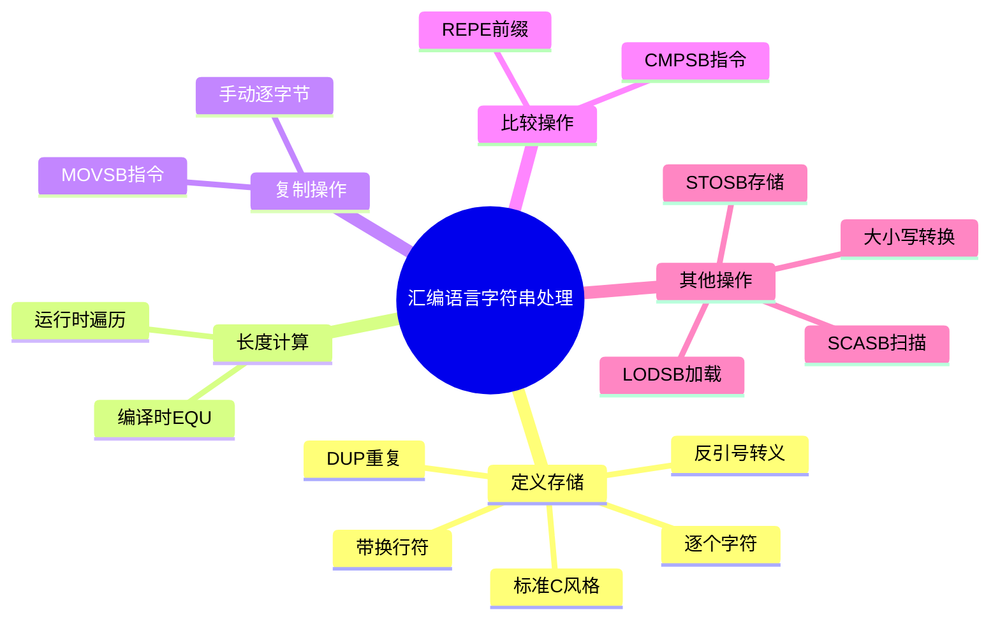
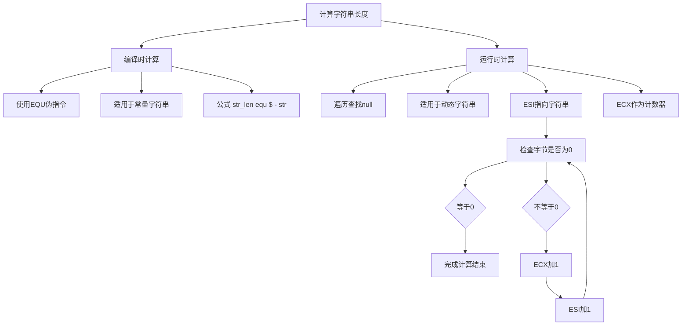
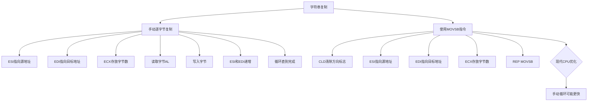
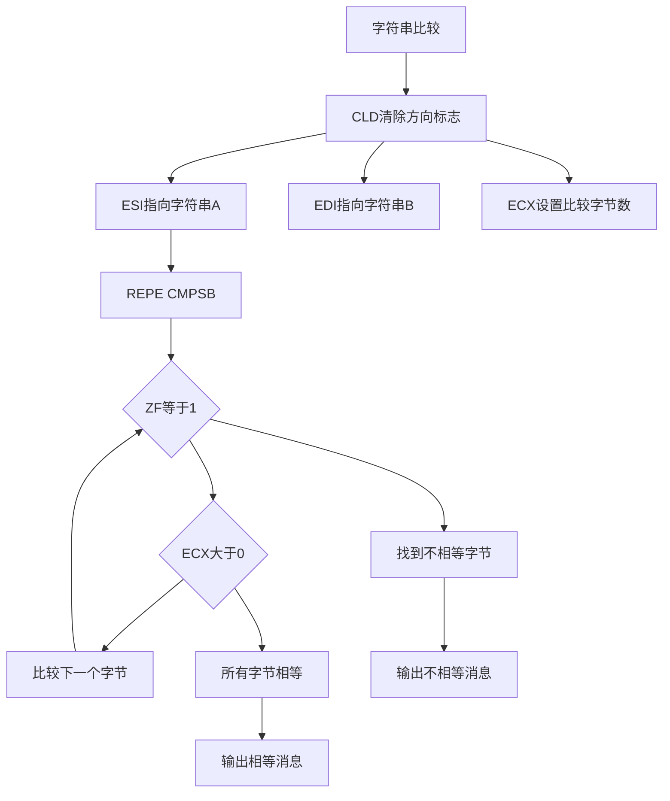
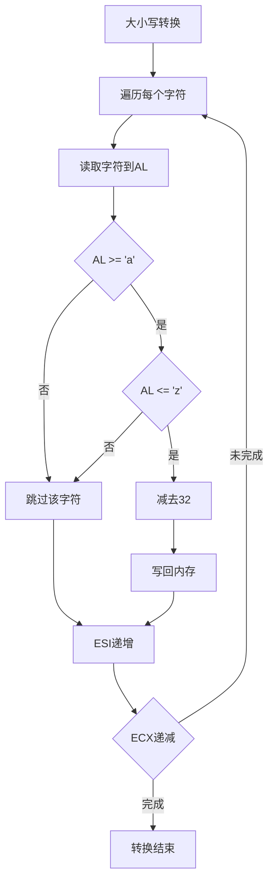
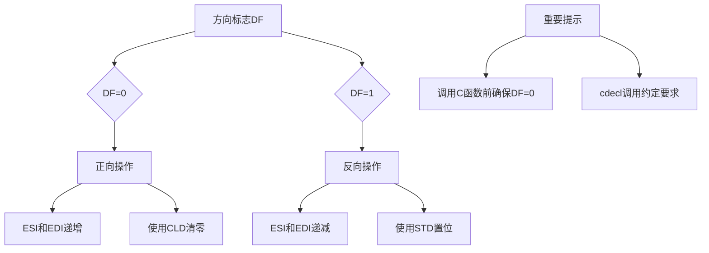

---
title: 汇编语言字符串处理
created: 2026-05-17
updated: 2026-05-17
categories: [汇编语言, 数据处理, 字符串处理]
categoryPath: "汇编语言/数据处理/字符串处理"
tags: [汇编语言, NASM, 字符串处理, x86]
sources: [raw/articles/汇编语言字符串处理.md]
confidence: high
diagramized: true
diagramizedAt: 2026-05-17
---

# 汇编语言字符串处理

## 概述

字符串处理是编程中最常见的需求之一。

在汇编语言中，处理字符串意味着直接操作内存中的字节序列。虽然比高级语言更底层，但也更灵活、更高效。



## 字符串的定义和存储

在 NASM 中，字符串本质上就是字节序列，使用 `DB`（Define Byte）伪指令来定义。

### 字符串定义方式

NASM 提供了多种定义字符串的方式：

**方式 1：标准 C 风格字符串**

```nasm
section .data
    str1 db 'Hello, runoob!', 0
```

这种方式以 null 字符（0）结尾，和 C 语言的字符串风格一致。

**方式 2：带换行符的字符串**

```nasm
section .data
    str2 db 'Line1', 0xA, 'Line2', 0xA
```

`0xA` 是 ASCII 换行符（\n），可以在字符串中间插入。

**方式 3：反引号支持转义序列**

```nasm
section .data
    str3 db `hello\nworld\n`, 0
```

使用反引号（\`）包裹字符串时，NASM 会自动转换转义序列。

**方式 4：逐个字符定义**

```nasm
section .data
    str4 db 'A', 'B', 'C', 'D', 0
```

可以逐个字符列出，用逗号分隔。

**方式 5：使用 DUP 生成重复字符**

```nasm
section .data
    border db 40 dup('-')
```

`40 dup('-')` 表示生成 40 个 '-' 字符，适合创建分隔线。

### 编译时字符串长度计算

使用 `equ` 可以在编译时计算字符串长度：

```nasm
section .data
    str1 db 'Hello, runoob!', 0
    str1_len equ $ - str1
```

`$` 表示当前地址，减去字符串起始地址就是字符串长度（包含结尾的 null）。

## 计算字符串长度



有两种主要方式获取字符串长度：

### 方式 A：编译时计算（适用于常量字符串）

对于在程序中定义好的固定字符串，可以用 `equ` 在编译时计算长度：

```nasm
section .data
    msg1 db 'Hello, RUNOOB!', 0xA
    msg1_len equ $ - msg1

section .text
    global _start

_start:
    mov eax, 4
    mov ebx, 1
    mov ecx, msg1
    mov edx, msg1_len
    int 0x80
```

这种方式效率最高，因为长度是在编译时确定的。

### 方式 B：运行时计算（适用于 null 结尾字符串）

对于动态字符串或未知长度的字符串，需要在运行时遍历查找 null 字符：

```nasm
section .data
    msg2 db 'Find my length', 0

section .text
    global _start

_start:
    mov esi, msg2
    mov ecx, 0

strlen_loop:
    cmp byte [esi], 0
    je strlen_done
    inc ecx
    inc esi
    jmp strlen_loop

strlen_done:
    ; ecx 现在存放字符串长度（不含 null）
```

**算法说明：**
1. `esi` 指向字符串起始地址
2. `ecx` 作为计数器，初始化为 0
3. 循环检查当前字节是否为 0
4. 如果不是，计数器加 1，指针加 1，继续循环
5. 遇到 0 时结束，`ecx` 中就是字符串长度

## 字符串复制



字符串复制有两种实现方式：

### 方式 A：手动逐字节复制

```nasm
section .data
    src db 'runoob source string', 0
    src_len equ $ - src

section .bss
    dest_manual resb 64

section .text
    global _start

_start:
    mov esi, src
    mov edi, dest_manual
    mov ecx, src_len

copy_loop:
    mov al, [esi]
    mov [edi], al
    inc esi
    inc edi
    loop copy_loop
```

**步骤说明：**
1. `esi` 指向源地址
2. `edi` 指向目标地址
3. `ecx` 存放要复制的字节数
4. 每次循环复制一个字节，然后两个指针都加 1

### 方式 B：使用字符串操作指令（更快）

x86 提供了专门的字符串操作指令 `MOVSB`：

```nasm
section .bss
    dest_fast resb 64

section .text
    cld
    mov esi, src
    mov edi, dest_fast
    mov ecx, src_len
    rep movsb
```

**关键指令说明：**
- `cld`：清除方向标志（DF=0），字符串操作正向进行（指针递增）
- `movsb`：复制一个字节：`[edi] = [esi]`，然后 `esi++`，`edi++`
- `rep`：重复执行后面的指令 `ecx` 次

**性能说明：**
`REP MOVSB` 是 x86 最经典的字符串复制方式。但在现代 CPU 上，手动复制循环配合循环展开可能更快，因为现代 CPU 对简单操作有更好的流水线优化。

## 字符串比较



使用 `CMPSB` 配合 `REPE` 指令可以逐字节比较字符串：

```nasm
section .data
    str_a db 'runoob', 0
    str_b db 'runoob', 0
    str_c db 'RUNOOB', 0
    eq_msg db 'Strings are equal', 0xA
    eq_len equ $ - eq_msg
    ne_msg db 'Strings are NOT equal', 0xA
    ne_len equ $ - ne_msg

section .text
    global _start

_start:
    cld
    mov esi, str_a
    mov edi, str_b
    mov ecx, 7

    repe cmpsb
    je strings_equal

    ; 不相等的处理
    mov eax, 4
    mov ebx, 1
    mov ecx, ne_msg
    mov edx, ne_len
    int 0x80
    jmp compare_next

strings_equal:
    mov eax, 4
    mov ebx, 1
    mov ecx, eq_msg
    mov edx, eq_len
    int 0x80

compare_next:
    ; 继续比较其他字符串...
```

**关键指令说明：**
- `cmpsb`：比较 `[esi]` 和 `[edi]`，然后 `esi++`，`edi++`
- `repe`：如果 ZF=1（相等）且 `ecx>0`，则继续执行
- `je`：根据 ZF 标志判断是否全部相等

## 字符串操作指令汇总

| 指令 | 功能 | 使用的寄存器 |
|------|------|-------------|
| MOVSB | 复制字节：`[EDI] = [ESI]` | ESI=源, EDI=目标, ECX=次数, DF=方向 |
| MOVSW | 复制字（2 字节） | 同上 |
| MOVSD | 复制双字（4 字节） | 同上 |
| STOSB | 存字节：`[EDI] = AL` | EDI=目标, AL=值, ECX=次数 |
| LODSB | 取字节：`AL = [ESI]` | ESI=源 |
| CMPSB | 比较字节：`[ESI] - [EDI]` | ESI=源, EDI=目标, ECX=次数 |
| SCASB | 扫描字节：`AL - [EDI]` | EDI=目标, AL=查找值, ECX=次数 |

## 大小写转换示例



下面是一个将字符串中小写字母转为大写的完整示例：

```nasm
section .data
    msg db 'Hello, runoob! Welcome to Assembly.', 0xA
    len equ $ - msg

section .text
    global _start

_start:
    ; 输出原始字符串
    mov eax, 4
    mov ebx, 1
    mov ecx, msg
    mov edx, len
    int 0x80

    ; 转换：小写 -> 大写
    mov esi, msg
    mov ecx, len

convert_loop:
    mov al, [esi]
    cmp al, 'a'
    jb next_char
    cmp al, 'z'
    ja next_char

    ; 小写转大写：'a'(97) - 'A'(65) = 32
    sub al, 32
    mov [esi], al

next_char:
    inc esi
    loop convert_loop

    ; 输出转换后的字符串
    mov eax, 4
    mov ebx, 1
    mov ecx, msg
    mov edx, len
    int 0x80

    mov eax, 1
    mov ebx, 0
    int 0x80
```

**算法说明：**
1. 遍历字符串中的每个字符
2. 检查字符是否在 'a'-'z' 范围内
3. 如果是小写字母，减去 32 转为大写（ASCII 码差值）
4. 将转换后的字符写回内存

**运行结果：**
```
Hello, runoob! Welcome to Assembly.
HELLO, RUNOOB! WELCOME TO ASSEMBLY.
```

## 方向标志 DF



方向标志（Direction Flag）决定了字符串操作的方向：

- **DF=0**（正向）：`esi` 和 `edi` 递增
- **DF=1**（反向）：`esi` 和 `edi` 递减

**相关指令：**
- `cld`：清零 DF（正向操作）
- `std`：置位 DF（反向操作）

**重要提示：**
在调用 C 函数或系统调用前，应该确保 DF=0，这是 cdecl 调用约定的要求。

## 相关概念

- [[汇编语言变量]] - 了解汇编中变量的定义和使用
- [[汇编语言寄存器]] - 了解 esi、edi 等寄存器的用途
- [[汇编语言内存分段]] - 了解数据段（.data）和 bss 段（.bss）

## 参考资料

- 原文来源：runoob 汇编语言教程
- 链接：https://www.runoob.com/assembly/assembly-string.html
