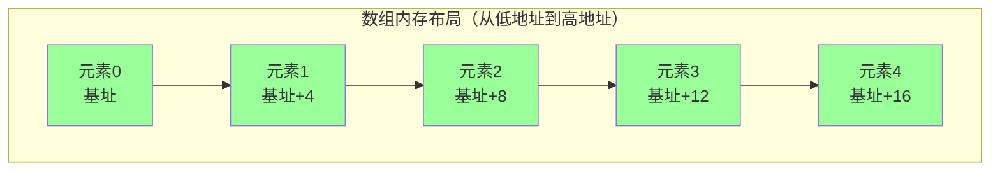
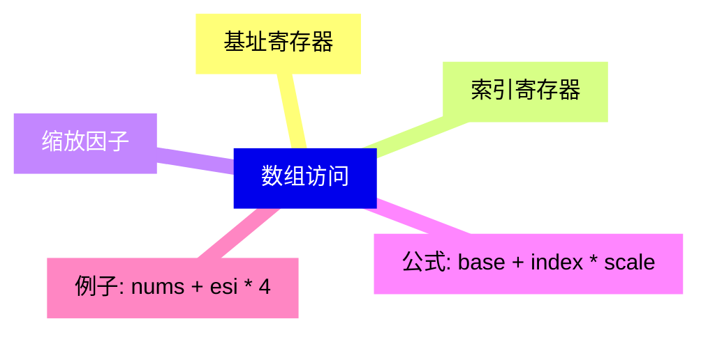
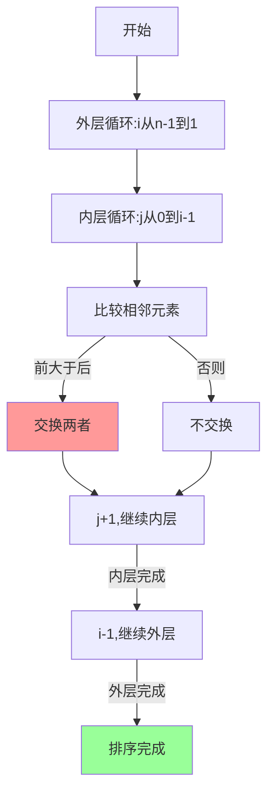

---
title: 汇编语言数组
created: 2026-05-17
updated: 2026-05-17
categories: [汇编语言, 数据处理, 数据结构]
categoryPath: "汇编语言/数据处理/数据结构"
tags: [汇编, 数组, 数据结构]
sources: [raw/articles/汇编语言数组.md]
confidence: high
diagramized: true
diagramizedAt: 2026-05-17
---

# 汇编语言数组

数组是汇编语言中最基础的数据结构之一。理解数组的工作原理对于掌握汇编编程至关重要。

## 概述

数组是连续存放的同类型数据集合。在汇编中，数组就是内存中一段连续的空间，通过基址加偏移的方式来访问每个元素。



数组的核心特点：
- 所有元素类型相同
- 在内存中连续存储
- 通过索引访问
- 没有边界检查（需要程序员自己保证）

## 一维数组定义

在汇编语言中，可以使用多种方式定义一维数组。

### 定义方式

#### 方式1：逐个列出元素

```nasm
section .data
arr1 dd 10, 20, 30, 40, 50  ; 5个双字元素的数组
```

每个元素都显式指定，适合元素较少且已知的情况。

#### 方式2：用 dup 初始化

```nasm
section .data
arr2 dd 10 dup(0)  ; 10个双字，全为0
```

`dup` 是 duplicate 的缩写，可以快速创建多个相同值的元素。

#### 方式3：字节数组

```nasm
section .data
bytes db 1, 2, 3, 4, 5, 6  ; 6个字节
```

使用 `db` 定义字节数组，每个元素占1字节。

#### 方式4：字符数组（字符串）

```nasm
section .data
chars db 'runoob', 0  ; 7字节（包括结尾的0）
```

字符串本质上就是字符数组，通常以0结尾（C风格字符串）。

#### 方式5：未初始化的数组

```nasm
section .bss
buffer resd 100  ; 预留100个双字的空间
```

使用 `resb`、`resw`、`resd` 等伪指令在 `.bss` 段预留空间。

### 数组长度计算

可以在编译时计算数组长度：

```nasm
arr1_len equ ($ - arr1) / 4  ; 双字数组的元素个数
arr2_len equ ($ - arr2) / 4
bytes_len equ ($ - bytes)    ; 字节数组，不需除法
```

- `$` 表示当前地址
- `$ - arr1` 得到数组占用的总字节数
- 除以元素大小（双字是4字节）得到元素个数

## 数组元素访问

访问数组元素使用 **基址 + 索引 × 元素大小** 的寻址方式。



### 基本访问方式

```nasm
section .data
nums dd 100, 200, 300, 400, 500  ; 5个元素
nums_len equ ($ - nums) / 4

section .text
global _start

_start:
    ; 访问第0个元素（下标0）
    mov eax, [nums]              ; eax = 100
    
    ; 访问第2个元素（下标2）
    mov eax, [nums + 2 * 4]      ; eax = nums[2] = 300
    ; 2 * 4 = 8，从nums偏移8字节
```

### 使用寄存器作为下标

```nasm
    ; 使用寄存器作为下标
    mov esi, 3                   ; 下标 = 3
    mov eax, [nums + esi * 4]    ; eax = nums[3] = 400
```

### 修改数组元素

```nasm
    ; 修改数组元素
    mov dword [nums + 4], 250    ; nums[1] = 250
    ; 数组中现在：100, 250, 300, 400, 500
```

### 使用基址寄存器

```nasm
    ; 使用EBX作为基址寄存器
    mov ebx, nums                ; ebx = 数组基址
    mov eax, [ebx + 4 * 4]       ; eax = nums[4] = 500
```

### 不同类型数组的访问

注意元素大小的区别：

| 类型 | 伪指令 | 大小 | 访问方式 |
|------|--------|------|----------|
| 字节 | db     | 1    | `[arr + esi]` |
| 字   | dw     | 2    | `[arr + esi * 2]` |
| 双字 | dd     | 4    | `[arr + esi * 4]` |

## 数组遍历

遍历数组是最常见的操作之一。有两种主要方式：使用索引或使用指针。

### 方式1：使用索引

```nasm
section .data
numbers dd 5, 10, 15, 20, 25, 30, 35, 40, 45, 50
count equ ($ - numbers) / 4  ; 元素个数

section .text
global _start

_start:
    mov ecx, count               ; 循环次数
    mov esi, 0                   ; 下标（从0开始）
    mov eax, 0                   ; 累加和

sum_loop:
    add eax, [numbers + esi * 4] ; 累加数组元素
    inc esi                      ; 下标 +1
    loop sum_loop
    ; eax = 5+10+15+...+50 = 275
```

### 方式2：使用指针

```nasm
    ; 另一种遍历方式：使用指针
    mov ecx, count
    mov ebx, numbers             ; ebx 指向数组起始
    mov eax, 0                   ; 累加和

sum_loop2:
    add eax, [ebx]               ; 累加当前元素
    add ebx, 4                   ; 指针移动到下一个元素
    loop sum_loop2
    ; eax = 275
```

指针方式的优点是不需要计算偏移，直接移动指针即可。

## 数组查找

在数组中查找指定值是常见操作。

### 线性查找示例

```nasm
section .data
data dd 12, 45, 67, 23, 89, 34, 56, 78, 90, 11
data_len equ ($ - data) / 4
target dd 23                   ; 要查找的值
found_msg db 'Found at index: ', 0
found_len equ $ - found_msg
notfound_msg db 'Not found', 0xA
notfound_len equ $ - notfound_msg
newline db 0xA

section .text
global _start

_start:
    mov ecx, data_len           ; 循环次数
    mov esi, 0                  ; 当前下标

search_loop:
    mov eax, [data + esi * 4]   ; 加载当前元素
    cmp eax, [target]           ; 是否等于目标值
    je found                    ; 找到了
    
    inc esi                     ; 下标 +1
    loop search_loop

    ; 没找到
    mov eax, 4
    mov ebx, 1
    mov ecx, notfound_msg
    mov edx, notfound_len
    int 0x80
    jmp exit

found:
    ; 找到了（esi是下标）
    mov eax, 4
    mov ebx, 1
    mov ecx, found_msg
    mov edx, found_len
    int 0x80
    
    ; 将下标转为ASCII字符输出
    add esi, '0'                ; 单数字下标转字符
    push esi                    ; 压栈作为临时存储
    mov eax, 4
    mov ebx, 1
    mov ecx, esp                ; 栈顶地址
    mov edx, 1
    int 0x80
    pop esi
    
    ; 输出换行
    mov eax, 4
    mov ebx, 1
    mov ecx, newline
    mov edx, 1
    int 0x80

exit:
    mov eax, 1
    mov ebx, 0
    int 0x80
```

## 二维数组

二维数组在内存中按行展开为一维存储。

```mermaid
graph TD
    subgraph "二维数组内存布局（3行4列）"
        A["第0行第0列"]
        B["第0行第1列"]
        C["第0行第2列"]
        D["第0行第3列"]
        E["第1行第0列"]
        F["第1行第1列"]
        G["第1行第2列"]
        H["第1行第3列"]
        I["第2行第0列"]
        J["第2行第1列"]
        K["第2行第2列"]
        L["第2行第3列"]
    end
    
    A --> B
    B --> C
    C --> D
    D --> E
    E --> F
    F --> G
    G --> H
    H --> I
    I --> J
    J --> K
    K --> L
    
    style A fill:#9f9
    style B fill:#9f9
    style C fill:#9f9
    style D fill:#9f9
    style E fill:#ff9
    style F fill:#ff9
    style G fill:#ff9
    style H fill:#ff9
    style I fill:#f99
    style J fill:#f99
    style K fill:#f99
    style L fill:#f99
```



### 内存布局

假设有一个3行4列的数组：

```
matrix[0][0], matrix[0][1], matrix[0][2], matrix[0][3],
matrix[1][0], matrix[1][1], matrix[1][2], matrix[1][3],
matrix[2][0], matrix[2][1], matrix[2][2], matrix[2][3]
```

### 地址计算公式

访问 `arr[i][j]` 的地址公式为：

```
地址 = 基址 + (i * 列数 + j) * 元素大小
```

### 二维数组示例

```nasm
section .data
; 3行4列的二维数组
matrix dd 1, 2, 3, 4
       dd 5, 6, 7, 8
       dd 9, 10, 11, 12

rows equ 3
cols equ 4
elem_size equ 4  ; 双字 = 4字节

section .text
global _start

_start:
    ; 访问 matrix[1][2] = 7（第2行第3列）
    ; 地址 = matrix + (1*4 + 2) * 4 = matrix + 24
    mov eax, [matrix + (1 * cols + 2) * elem_size]
    ; eax = 7
```

### 动态计算索引

```nasm
    ; 使用寄存器动态计算（假设 i=2, j=1）
    ; matrix[2][1] = 10（第3行第2列）
    mov esi, 2                   ; 行 i = 2
    mov edi, 1                   ; 列 j = 1
    
    mov eax, cols                ; 列数
    mul esi                      ; eax = i * cols = 2*4 = 8
    add eax, edi                 ; eax = i*cols + j = 8+1 = 9
    mov eax, [matrix + eax * elem_size]
    ; eax = 10
```

### 遍历二维数组

```nasm
    ; 遍历二维数组所有元素
    mov ecx, rows * cols         ; 总元素数 = 12
    mov esi, 0                   ; 下标
    mov ebx, 0                   ; 累加和

traverse:
    add ebx, [matrix + esi * elem_size]
    inc esi
    loop traverse
    ; ebx = 1+2+3+...+12 = 78
```

## 冒泡排序完整示例

冒泡排序是经典的排序算法，很好地展示了数组的操作。

### 冒泡排序原理



1. 比较相邻元素，如果前一个比后一个大，就交换它们
2. 对每一对相邻元素重复步骤1，从开始第一对到结尾最后一对
3. 完成一轮后，最后的元素会是最大的数
4. 针对所有未排序的元素重复以上步骤

### 汇编实现

```nasm
section .data
array dd 64, 34, 25, 12, 22, 11, 90, 78
array_len equ ($ - array) / 4

section .text
global _start

_start:
    mov ecx, array_len           ; 外层循环：n次
    dec ecx                      ; 外层只需n-1次

outer_loop:
    push ecx                     ; 保存外层计数器
    
    mov esi, 0                   ; 内层下标从0开始
    mov ecx, array_len - 1       ; 内层循环次数

inner_loop:
    mov eax, [array + esi * 4]   ; a[j]
    mov ebx, [array + esi * 4 + 4] ; a[j+1]
    cmp eax, ebx                 ; a[j] > a[j+1] ?
    jle no_swap                  ; 否，不交换
    
    ; 交换 a[j] 和 a[j+1]
    mov [array + esi * 4], ebx
    mov [array + esi * 4 + 4], eax

no_swap:
    inc esi
    loop inner_loop

    pop ecx
    loop outer_loop
    ; 数组现在已排序：11, 12, 22, 25, 34, 64, 78, 90

    mov eax, 1
    mov ebx, 0
    int 0x80
```

## 重要注意事项

### 没有边界检查

汇编语言中的数组**没有任何边界检查**。访问越界的索引不会报错，而是会静默地读写邻近内存中的数据。

这可能导致：
- 难以调试的 bug
- 安全漏洞（如缓冲区溢出）
- 程序行为不可预测

### 如何避免问题

1. 始终确保索引在合法范围内
2. 使用编译器计算数组长度
3. 在循环中使用正确的终止条件
4. 考虑添加运行时检查（如果需要）

## 相关概念

- [[汇编语言寻址方式]] - 理解各种寻址方式对于数组操作很重要
- [[汇编语言循环结构]] - 遍历数组经常需要使用循环
- [[汇编语言变量]] - 数组是一种特殊的变量
- [[C语言函数调用栈（一）]] - 理解栈对于理解数组也有帮助

## 参考资料

- [汇编语言数组教程](https://www.runoob.com/assembly/assembly-array.html)
