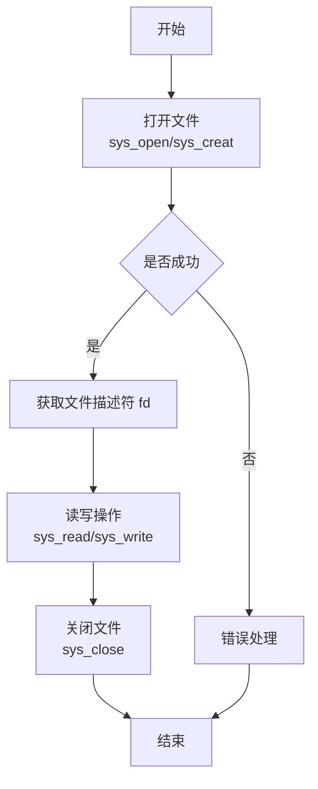
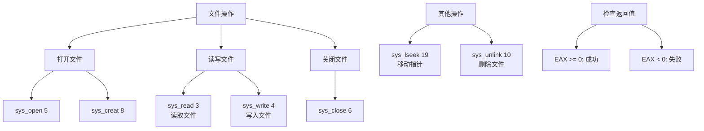

---
title: 汇编语言文件管理
created: 2026-05-17
updated: 2026-05-17
categories: [汇编语言, 数据处理, 数据结构]
categoryPath: "汇编语言/数据处理/数据结构"
tags: [汇编, 文件管理, 系统调用, Linux]
sources: [raw/articles/汇编语言文件管理.md]
confidence: high
diagramized: true
diagramizedAt: 2026-05-17
---

# 汇编语言文件管理

文件管理是程序与外部存储交互的基础。通过系统调用，汇编程序可以打开、读取、写入和关闭文件，与高级语言一样灵活地处理文件 IO。

## 概述

### 什么是文件管理

在计算机中，文件是存储在磁盘上的数据集合。程序通过文件系统与文件交互。

汇编语言通过系统调用来操作文件，主要包括：
- 打开/创建文件
- 读取文件内容
- 写入数据到文件
- 关闭文件
- 移动文件指针
- 删除文件

### 文件操作的基本流程

文件操作通常遵循以下步骤：

1. **打开文件** - 获取文件描述符
2. **读写操作** - 使用文件描述符进行读写
3. **关闭文件** - 释放资源



### 标准文件描述符

Linux 系统为每个进程默认打开 3 个文件描述符：

| 文件描述符 | 名称 | 说明 |
| --- | --- | --- |
| 0 | stdin | 标准输入（键盘） |
| 1 | stdout | 标准输出（屏幕） |
| 2 | stderr | 标准错误（屏幕） |

这些标准文件描述符在程序启动时自动打开，可以直接使用。

---

## 文件操作相关的系统调用

| 系统调用 | 调用号（EAX） | 用途 | 主要参数 |
| --- | --- | --- | --- |
| sys_open | 5 | 打开/创建文件 | EBX=文件名, ECX=标志, EDX=权限 |
| sys_read | 3 | 读取文件 | EBX=fd, ECX=缓冲区, EDX=字节数 |
| sys_write | 4 | 写入文件 | EBX=fd, ECX=缓冲区, EDX=字节数 |
| sys_close | 6 | 关闭文件 | EBX=fd |
| sys_creat | 8 | 创建文件（旧方式） | EBX=文件名, ECX=权限 |
| sys_lseek | 19 | 移动文件指针 | EBX=fd, ECX=偏移, EDX=起始位置 |
| sys_unlink | 10 | 删除文件 | EBX=文件名 |

---

## 文件打开标志

打开文件时，需要指定访问模式和行为标志。多个标志可以通过 OR（|）组合使用。

### 访问模式（三选一）

| 常量 | 值 | 说明 |
| --- | --- | --- |
| O_RDONLY | 0 | 只读模式 |
| O_WRONLY | 1 | 只写模式 |
| O_RDWR | 2 | 读写模式 |

### 行为标志（可多选）

| 常量 | 值（十六进制） | 值（十进制） | 说明 |
| --- | --- | --- | --- |
| O_CREAT | 0x40 | 64 | 如果文件不存在则创建 |
| O_TRUNC | 0x200 | 512 | 打开时清空文件内容 |
| O_APPEND | 0x400 | 1024 | 追加到文件末尾 |
| O_EXCL | 0x80 | 128 | 与 O_CREAT 一起使用，文件已存在则报错 |

### 标志组合示例

```nasm
; 只写 + 创建 + 清空 = 577 (1 + 64 + 512)
mov ecx, 577

; 只写 + 创建 + 追加 = 1089 (1 + 64 + 1024)
mov ecx, 0x441
```


---

## 文件权限

使用 O_CREAT 创建文件时，需要指定文件权限。权限用八进制表示：

| 权限 | 八进制 | 说明 |
| --- | --- | --- |
| 0o644 | 644 | 所有者读写，组只读，其他只读 |
| 0o666 | 666 | 所有用户读写 |
| 0o755 | 755 | 所有者读写执行，组读执行，其他读执行 |

最常用的是 0o644，对应一般的文本文件。

---

## 创建并写入文件

### sys_creat - 创建文件

`sys_creat` 是创建新文件的传统方式。

| 参数 | 寄存器 | 说明 |
| --- | --- | --- |
| 文件名 | EBX | 以 null 结尾的字符串地址 |
| 权限 | ECX | 文件权限（八进制） |

返回值（EAX）：
- 成功：返回文件描述符（非负整数）
- 失败：返回负的错误码

### 示例：创建文件并写入内容

```nasm
; 文件路径：file_write.asm
; 创建文件并写入内容

section .data
    filename db 'runoob_output.txt', 0    ; 文件名（null 结尾）
    content db 'Hello, RUNOOB!', 0xA      ; 要写入的内容
    content_len equ $ - content
    create_msg db 'File created successfully!', 0xA
    create_msg_len equ $ - create_msg

section .bss
    fd resd 1                            ; 文件描述符

section .text
global _start

_start:
    ; 1. 创建文件
    mov eax, 8                          ; sys_creat (8)
    mov ebx, filename                   ; 文件名
    mov ecx, 0o644                      ; 权限：rw-r--r--
    int 0x80

    mov [fd], eax                       ; 保存文件描述符

    ; 2. 写入内容到文件
    mov eax, 4                          ; sys_write (4)
    mov ebx, [fd]                       ; 文件描述符
    mov ecx, content                    ; 数据地址
    mov edx, content_len                ; 数据长度
    int 0x80

    ; 3. 关闭文件
    mov eax, 6                          ; sys_close (6)
    mov ebx, [fd]                       ; 文件描述符
    int 0x80

    ; 4. 提示成功
    mov eax, 4
    mov ebx, 1
    mov ecx, create_msg
    mov edx, create_msg_len
    int 0x80

    mov eax, 1
    mov ebx, 0
    int 0x80
```

### 编译运行

```bash
$ nasm -f elf32 file_write.asm -o file_write.o
$ ld -m elf_i386 file_write.o -o file_write
$ ./file_write
File created successfully!
$ cat runoob_output.txt
Hello, RUNOOB!
```

---

## 读取文件内容

### sys_open - 打开文件

`sys_open` 用于打开已存在的文件，或配合标志创建新文件。

| 参数 | 寄存器 | 说明 |
| --- | --- | --- |
| 文件名 | EBX | 以 null 结尾的字符串地址 |
| 标志 | ECX | 打开标志 |
| 权限 | EDX | 仅在创建文件时使用 |

### sys_read - 读取文件

| 参数 | 寄存器 | 说明 |
| --- | --- | --- |
| 文件描述符 | EBX | 已打开的文件描述符 |
| 缓冲区 | ECX | 存储读取数据的内存地址 |
| 字节数 | EDX | 最多读取的字节数 |

返回值（EAX）：
- 成功：返回实际读取的字节数（0 表示文件结束）
- 失败：返回负的错误码

### 示例：打开并读取文件

```nasm
; 文件路径：file_read.asm
; 打开并读取文件内容

section .data
    filename db 'runoob_output.txt', 0
    open_error db 'Error: cannot open file', 0xA
    open_error_len equ $ - open_error
    read_success db 'File content:', 0xA
    read_success_len equ $ - read_success

section .bss
    fd resd 1
    buffer resb 1024                    ; 读取缓冲区

section .text
global _start

_start:
    ; 1. 打开文件（只读）
    mov eax, 5                          ; sys_open (5)
    mov ebx, filename                   ; 文件名
    mov ecx, 0                          ; 只读模式 (O_RDONLY)
    mov edx, 0                          ; 权限（只读时忽略）
    int 0x80

    cmp eax, 0                          ; 文件描述符 < 0 表示错误
    jl open_failed

    mov [fd], eax                       ; 保存文件描述符

    ; 2. 读取文件内容
    mov eax, 3                          ; sys_read (3)
    mov ebx, [fd]                       ; 文件描述符
    mov ecx, buffer                     ; 缓冲区
    mov edx, 1024                       ; 最多读取 1024 字节
    int 0x80
    ; 返回值 eax = 实际读取的字节数
    mov esi, eax                        ; 保存读取字节数

    ; 3. 关闭文件
    mov eax, 6                          ; sys_close (6)
    mov ebx, [fd]
    int 0x80

    ; 4. 输出提示信息
    mov eax, 4
    mov ebx, 1
    mov ecx, read_success
    mov edx, read_success_len
    int 0x80

    ; 5. 输出文件内容到屏幕
    mov eax, 4
    mov ebx, 1
    mov ecx, buffer
    mov edx, esi                        ; 使用实际读取的字节数
    int 0x80
    jmp exit

open_failed:
    mov eax, 4
    mov ebx, 1
    mov ecx, open_error
    mov edx, open_error_len
    int 0x80

exit:
    mov eax, 1
    mov ebx, 0
    int 0x80
```

### 编译运行

```bash
$ nasm -f elf32 file_read.asm -o file_read.o
$ ld -m elf_i386 file_read.o -o file_read
$ ./file_read
File content:
Hello, RUNOOB!
```

---

## 追加写入文件

使用 O_APPEND 标志可以在文件末尾追加内容，而不会覆盖原有内容。

### 示例：追加模式写入文件

```nasm
; 文件路径：file_append.asm
; 以追加模式打开文件并写入

section .data
    filename db 'runoob_log.txt', 0
    log_entry db '[INFO] Program executed successfully.', 0xA
    log_len equ $ - log_entry

section .bss
    fd resd 1

section .text
global _start

_start:
    ; 打开文件（创建 + 追加模式）
    mov eax, 5                          ; sys_open (5)
    mov ebx, filename                   ; 文件名
    mov ecx, 0x441                      ; O_WRONLY | O_CREAT | O_APPEND
    ; O_WRONLY=1, O_CREAT=0x40, O_APPEND=0x400
    ; 组合：1 + 64 + 1024 = 1089 = 0x441
    mov edx, 0o644                      ; 创建时的权限
    int 0x80

    mov [fd], eax

    ; 追加写入
    mov eax, 4                          ; sys_write (4)
    mov ebx, [fd]                       ; 文件描述符
    mov ecx, log_entry                  ; 日志内容
    mov edx, log_len
    int 0x80

    ; 关闭文件
    mov eax, 6
    mov ebx, [fd]
    int 0x80

    mov eax, 1
    mov ebx, 0
    int 0x80
```

---

## 复制文件

这是一个综合示例，演示如何将一个文件的内容复制到另一个文件。

### 示例：文件复制程序

```nasm
; 文件路径：file_copy.asm
; 复制文件：将 runoob_input.txt 复制到 runoob_copy.txt

section .data
    src_file db 'runoob_input.txt', 0
    dst_file db 'runoob_copy.txt', 0
    success_msg db 'File copied successfully!', 0xA
    success_len equ $ - success_msg
    error_msg db 'Error during file copy', 0xA
    error_len equ $ - error_msg

section .bss
    src_fd resd 1
    dst_fd resd 1
    buffer resb 4096                    ; 4KB 复制缓冲区

section .text
global _start

_start:
    ; 1. 打开源文件（只读）
    mov eax, 5
    mov ebx, src_file
    mov ecx, 0                          ; O_RDONLY
    mov edx, 0
    int 0x80
    cmp eax, 0
    jl error_exit
    mov [src_fd], eax

    ; 2. 创建目标文件
    mov eax, 8                          ; sys_creat
    mov ebx, dst_file
    mov ecx, 0o644
    int 0x80
    cmp eax, 0
    jl error_exit
    mov [dst_fd], eax

copy_loop:
    ; 3. 从源文件读取
    mov eax, 3                          ; sys_read
    mov ebx, [src_fd]
    mov ecx, buffer
    mov edx, 4096
    int 0x80
    ; eax = 实际读取的字节数
    cmp eax, 0                          ; 读到 0 字节？
    jle copy_done                       ; 是，文件结束

    ; 4. 写入目标文件
    mov esi, eax                        ; 保存读取的字节数
    mov eax, 4                          ; sys_write
    mov ebx, [dst_fd]
    mov ecx, buffer
    mov edx, esi                        ; 写入实际读取的字节数
    int 0x80
    jmp copy_loop                       ; 继续循环

copy_done:
    ; 5. 关闭文件
    mov eax, 6                          ; sys_close
    mov ebx, [src_fd]
    int 0x80

    mov eax, 6
    mov ebx, [dst_fd]
    int 0x80

    ; 6. 输出成功信息
    mov eax, 4
    mov ebx, 1
    mov ecx, success_msg
    mov edx, success_len
    int 0x80
    jmp exit

error_exit:
    mov eax, 4
    mov ebx, 1
    mov ecx, error_msg
    mov edx, error_len
    int 0x80

exit:
    mov eax, 1
    mov ebx, 0
    int 0x80
```

---

## 错误处理的重要性

> **重要提示**：文件操作前后务必检查系统调用的返回值（在 EAX 中）。
> 
> - 负值表示错误
> - 常见错误码：
>   - -2 (ENOENT)：文件不存在
>   - -13 (EACCES)：权限不足
>   - -9 (EBADF)：无效的文件描述符
> 
> 忽略错误返回值是文件操作 bug 的最大来源。

### 错误处理示例

```nasm
    ; 打开文件
    mov eax, 5
    mov ebx, filename
    mov ecx, 0
    int 0x80
    
    cmp eax, 0
    jl handle_error                     ; 如果 EAX < 0，处理错误
    
    mov [fd], eax                       ; 否则保存文件描述符
    
    ; ... 继续操作 ...
    
handle_error:
    ; 错误处理逻辑
    mov eax, 4
    mov ebx, 2                          ; 输出到 stderr
    mov ecx, error_msg
    mov edx, error_len
    int 0x80
```

---

## 文件操作总结



---

## 相关概念

- [[汇编语言系统调用]] - 系统调用的基础知识
- [[汇编语言寄存器]] - 寄存器的使用
- [[汇编语言基础语法]] - 汇编程序的基本结构
- [[汇编语言内存分段]] - 数据段和 bss 段的使用
