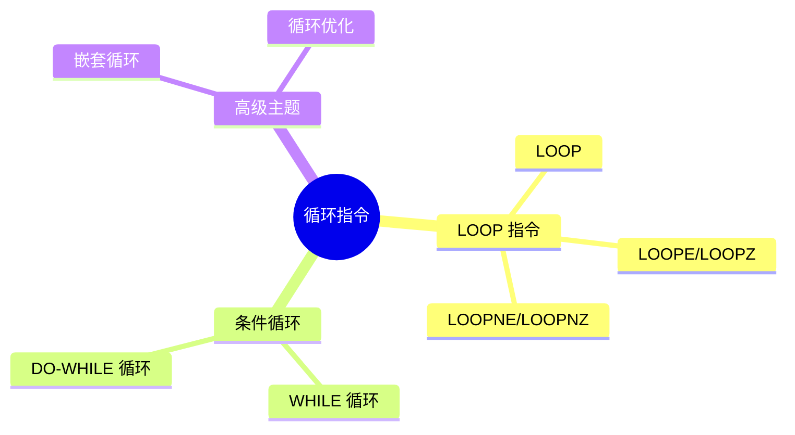
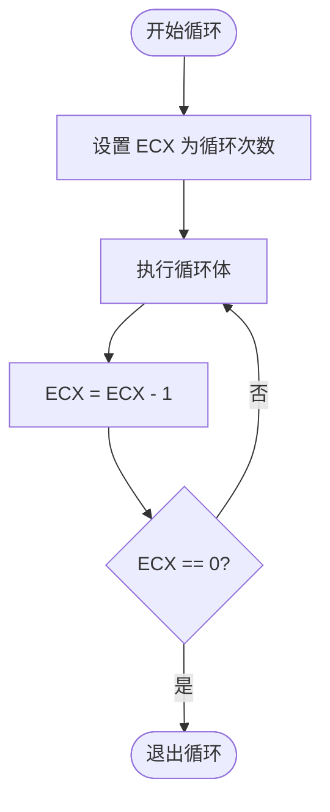
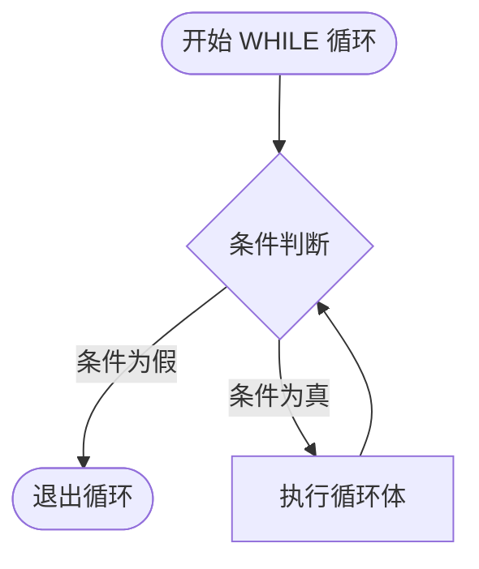
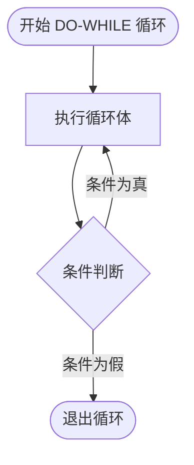
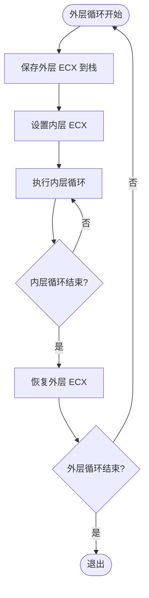

---
title: 汇编语言循环结构
created: 2026-05-17
updated: 2026-05-17
categories: [汇编语言, 核心概念, 指令集]
categoryPath: "汇编语言/核心概念/指令集"
tags: [汇编, 循环, LOOP, WHILE, DO-WHILE, 嵌套循环]
sources: [raw/articles/汇编语言循环结构.md]
confidence: high
diagramized: true
diagramizedAt: 2026-05-17
---

# 汇编语言循环结构

循环是程序中最常见的控制结构之一。在汇编语言中，你可以用 LOOP 指令或条件跳转来实现各种循环逻辑。

## 概述

在汇编语言中，循环主要有两种实现方式：
1. **LOOP 指令家族** - 使用 ECX 作为计数器，x86 专用指令
2. **条件跳转指令** - 使用 [CMP](汇编语言条件判断.md) 和 [Jcc](汇编语言条件判断.md) 实现灵活的循环逻辑

这种设计使得汇编语言的循环非常灵活，从简单的计数循环到复杂的条件循环都能轻松实现。

### 循环指令家族概览



## LOOP 指令

`LOOP` 是 x86 专门为循环设计的指令，它使用 ECX 作为计数器：

每次执行 LOOP 时，ECX 自动减 1，如果 ECX 不为 0 就跳转到目标标签。

### LOOP 指令工作原理



### LOOP 实例

```nasm
; 文件路径：loop_basic.asm
; LOOP 指令基本用法：重复 5 次输出

section .data
 msg db 'runoob', 0xA
 len equ $ - msg

section .text
global _start

_start:
mov ecx, 5 ; 循环计数器 = 5（循环 5 次）

repeat:
; 保存 ecx（系统调用可能修改它）
push ecx

; 输出 msg
mov eax, 4
mov ebx, 1
mov ecx, msg
mov edx, len
int 0x80

; 恢复 ecx
pop ecx
loop repeat ; ecx--; if ecx != 0 跳转到 repeat

mov eax, 1
mov ebx, 0
int 0x80
```

运行结果：
```
$ nasm -f elf32 loop_basic.asm -o loop_basic.o
$ ld -m elf_i386 loop_basic.o -o loop_basic
$ ./loop_basic
runoob
runoob
runoob
runoob
runoob
```

> `loop` 默认使用 ECX（32位）作为计数器。在 16 位模式下使用 CX，64 位模式下使用 RCX。务必在 loop 之前正确设置 ECX 的值。

> **注意**：在循环体中如果调用了系统调用或其他函数，ECX 可能会被修改，需要用 `push ecx` 和 `pop ecx` 来保存和恢复。

## LOOP 的变体

| 指令              | 跳转条件              | 说明              |
| --------------- | ----------------- | --------------- |
| LOOP            | ECX != 0          | 标准循环，先减 ECX 再判断 |
| LOOPE / LOOPZ   | ECX != 0 且 ZF = 1 | 相等时继续循环         |
| LOOPNE / LOOPNZ | ECX != 0 且 ZF = 0 | 不等时继续循环         |

### LOOPE / LOOPZ 实例

```nasm
; LOOPE 示例：在数组中查找第一个非零值

section .data
 array db 0, 0, 0, 5, 0, 0 ; 前三个是 0，第四个是 5

section .text
global _start

_start:
mov ecx, 6 ; 数组长度
mov esi, array - 1 ; 指向数组前一个位置

find_nonzero:
inc esi ; 移动到下一个元素
cmp byte [esi], 0 ; 当前元素 == 0 ?
loope find_nonzero ; 如果是 0 且 ecx > 0，继续循环
; 循环结束：找到了第一个非零元素，或遍历结束

; esi 现在指向第一个非零元素的地址
; ecx 剩余未比较的元素个数

mov eax, 1
mov ebx, 0
int 0x80
```

LOOPE 指令适合用于查找第一个不满足条件的元素，例如在数组中查找第一个非零值、第一个不等于特定值的元素等场景。

## 条件循环（WHILE 循环）

用条件跳转实现 while 循环：先判断条件，再执行循环体。

### WHILE 循环结构



### WHILE 循环实例

```nasm
; 文件路径：while_loop.asm
; 实现：while (x < 100) x = x * 2;

section .data
 x dd 1
 limit dd 100

section .text
global _start

_start:
; while 循环
while_start:
mov eax, [x] ; 加载 x
cmp eax, [limit] ; x < 100 ?
jge while_end ; 如果 x >= 100，结束循环

shl eax, 1 ; x = x * 2
mov [x], eax ; 存回 x

jmp while_start ; 回到循环开始，重新判断

while_end:
; x 现在是 128（1->2->4->8->16->32->64->128，128 >= 100 停止）

mov eax, 1
mov ebx, [x] ; 返回 x 作为退出码
int 0x80
```

WHILE 循环的特点是**先判断后执行**，如果条件一开始就不满足，循环体可能一次都不会执行。

## DO-WHILE 循环

先执行循环体，再判断条件。DO-WHILE 循环保证循环体至少执行一次。

### DO-WHILE 循环结构



### DO-WHILE 循环实例

```nasm
; DO-WHILE 循环：至少执行一次

section .data
 counter dd 0

section .text
global _start

_start:
mov dword [counter], 0

do_loop:
; 循环体：counter++（至少执行一次）
inc dword [counter]

; 判断条件
cmp dword [counter], 5
jl do_loop ; counter < 5 时继续
; counter 最终 = 5

mov eax, 1
mov ebx, 0
int 0x80
```

DO-WHILE 循环适合需要至少执行一次的场景，例如用户输入验证、资源初始化等。

## 嵌套循环

嵌套循环需要注意外层计数器的保存。嵌套循环在处理二维数组、打印表格、矩阵运算等场景中非常常用。

### 嵌套循环结构



### 嵌套循环实例

```nasm
; 文件路径：nested_loop.asm
; 嵌套循环示例：打印乘法表（3×3）

section .data
 space db ' '
 newline db 0xA
; 用于存放转换后的数字字符（2位 + 空格 + null）
 num_str db ' ', 0

section .text
global _start

_start:
mov ecx, 3 ; 外层循环计数器（行数）

outer_loop:
push ecx ; ★ 保存外层计数器！（重要）
mov ecx, 3 ; 内层循环计数器（列数）

inner_loop:
push ecx ; 保存内层计数器

; 计算乘积 = 外层行号(4-当前ecx) × 内层列号
; 此处省略具体数字转换输出，仅演示结构
; 实际输出：行号×列号

pop ecx ; 恢复内层计数器
loop inner_loop ; 内层循环

; 输出换行
mov eax, 4
mov ebx, 1
mov ecx, newline
mov edx, 1
int 0x80

pop ecx ; ★ 恢复外层计数器
loop outer_loop ; 外层循环

mov eax, 1
mov ebx, 0
int 0x80
```

> 嵌套循环中最常见的错误是忘记用栈保存外层计数器的值。LOOP 会修改 ECX，当你在内层循环中重新设置 ECX 时，外层的计数值就丢失了。解决方法是每次进入内层循环前 `push ecx`，离开后 `pop ecx`。

## 循环优化技巧

一些提高循环效率的方法：

### 优化技术对比

| 优化技术 | 优点 | 缺点 | 适用场景 |
|--------|------|------|--------|
| LOOP 指令 | 代码简洁 | 性能略低 | 简单循环，代码可读性重要 |
| DEC + JNZ | 性能较好 | 需要手工计数 | 大多数场景 |
| 循环展开 | 性能最佳 | 代码体积大 | 性能关键路径 |
| 倒计数 | 减少比较指令 | 逻辑稍复杂 | 数组遍历 |

### 循环优化实例

```nasm
; 循环优化对比

; 方式A：使用 LOOP 指令（较慢，但不明显）
mov ecx, 1000
loop_a:
add eax, [ebx]
add ebx, 4
loop loop_a

; 方式B：使用条件跳转（手工计数）（通常更快）
mov ecx, 1000
loop_b:
add eax, [ebx]
add ebx, 4
dec ecx
jnz loop_b

; 方式C：循环展开（最快，但代码体积大）
; 将 1000 次循环展开为每次处理 4 个元素
mov ecx, 250 ; 1000 / 4 = 250
loop_unrolled:
add eax, [ebx]
add eax, [ebx + 4]
add eax, [ebx + 8]
add eax, [ebx + 12]
add ebx, 16
dec ecx
jnz loop_unrolled

; 方式D：倒计数（减少比较指令）
mov ecx, 1000
lea ebx, [array + 1000*4 - 4] ; 从数组末尾开始
loop_reverse:
add eax, [ebx]
sub ebx, 4
dec ecx
jnz loop_reverse
```

循环优化的核心原则是**减少循环内的指令数量**和**避免分支预测失败**。现代处理器通常对简单的 `DEC + JNZ` 模式有很好的优化。

## 完整示例：计算 1 到 100 的和

```nasm
; 文件路径：sum_1_to_100.asm
; 计算 1+2+...+100 = 5050

section .data
 msg db 'Sum of 1 to 100 is: '
 msg_len equ $ - msg
 newline db 0xA

section .bss
 result_str resb 12 ; 存放转换后的数字字符串

section .text
global _start

_start:
; 计算累加和
mov ecx, 100 ; 循环 100 次
mov eax, 0 ; 累加和初始为 0
mov ebx, 1 ; 当前要加的数

sum_loop:
add eax, ebx ; eax += ebx
inc ebx ; 下一个数
loop sum_loop ; 继续循环
; eax = 5050

; 输出提示文字
push eax ; 保存结果
mov eax, 4
mov ebx, 1
mov ecx, msg
mov edx, msg_len
int 0x80
pop eax ; 恢复结果

; 将数字转为字符串（简单版：直接输出整数值）
; 这里简化处理，将 eax 的低字节转为字符
add al, '0' ; 不准确，仅演示
mov [result_str], al

; 输出结果
mov eax, 4
mov ebx, 1
mov ecx, result_str
mov edx, 12
int 0x80

mov eax, 4
mov ebx, 1
mov ecx, newline
mov edx, 1
int 0x80

mov eax, 1
mov ebx, 0
int 0x80
```

> 数字转字符串是汇编中的一个常见问题。上面的简单方法只在数字是 0-9 时有效。完整的数字转字符串算法将在"数字处理"章节详细讲解。

## 相关概念

- [汇编语言条件判断](汇编语言条件判断.md) - 了解 CMP 和 Jcc 指令，条件跳转是实现自定义循环的基础
- [汇编语言寄存器](汇编语言寄存器.md) - ECX 寄存器的详细介绍
- [汇编语言算术指令](汇编语言算术指令.md) - 循环中常用的 INC、DEC、ADD 等指令

## 参考资料

- 来源：https://www.runoob.com/assembly/assembly-loop.html
