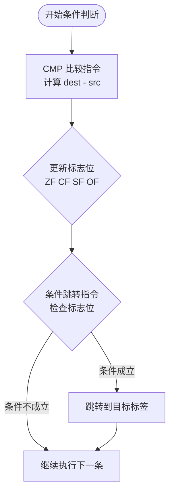
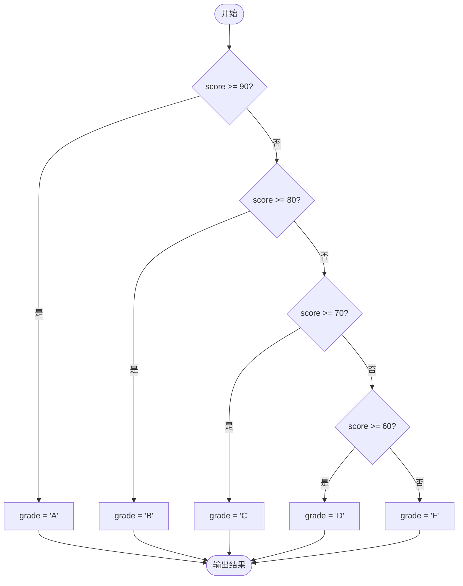
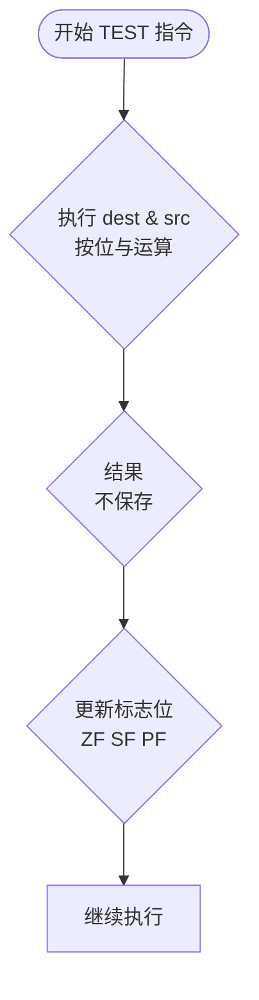
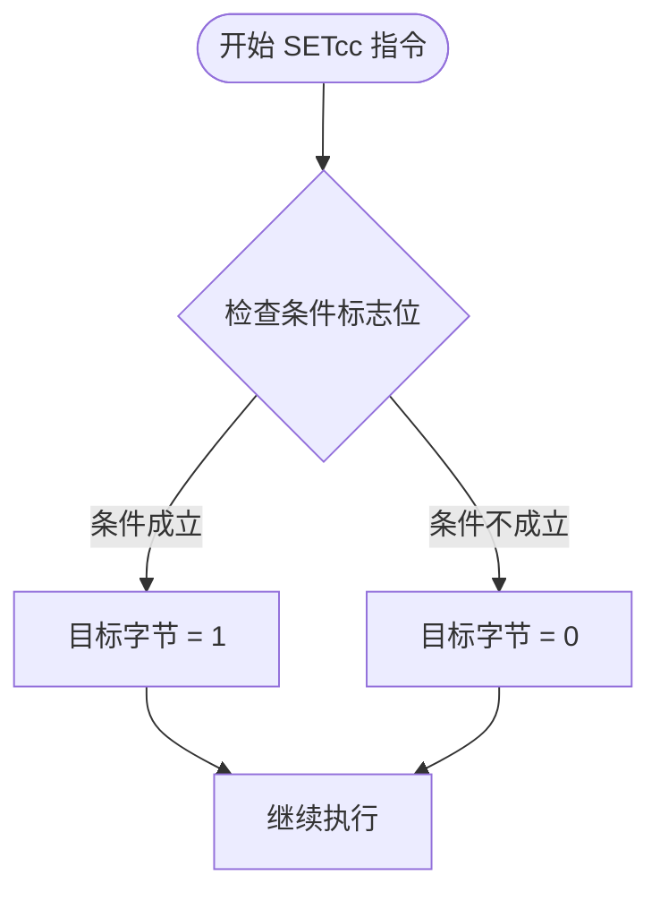

---
title: 汇编语言条件判断
created: 2026-05-17
updated: 2026-05-17
categories: [汇编语言, 核心概念, 指令集]
categoryPath: "汇编语言/核心概念/指令集"
tags: [汇编, 条件判断, CMP, 跳转指令, TEST, SETcc]
sources: [raw/articles/汇编语言条件判断.md]
confidence: high
diagramized: true
diagramizedAt: 2026-05-17
---

# 汇编语言条件判断

条件判断是程序控制流的基石。汇编语言通过比较指令和条件跳转指令来实现 if-else、switch 等判断逻辑。

## 概述

在汇编语言中，条件判断主要依赖两个核心机制：
1. **比较指令** - 通过运算更新 CPU 标志位
2. **条件跳转指令** - 根据标志位状态决定是否跳转

这种设计使得汇编语言的条件判断非常灵活，但也需要开发者理解标志位的工作原理。

### 条件判断核心机制



## CMP - 比较指令

`CMP` 对两个操作数做减法运算（目标 - 源），但不保存结果，只更新标志位。

本质上 `CMP dest, src` 等同于 `SUB dest, src` 但丢弃计算结果。

### 工作原理

当执行 `CMP a, b` 时：
- 计算 `a - b`，但不修改 `a` 的值
- 根据结果更新标志位（ZF、CF、SF、OF 等）
- 后续的条件跳转指令根据这些标志位判断

### CMP 实例

```nasm
; CMP 比较指令示例
section .text
global _start

_start:
    mov eax, 10
    cmp eax, 10      ; eax == 10?
    ; ZF = 1（相等，结果为零）
    ; CF = 0（无借位）
    ; SF = 0（结果非负）

    mov eax, 5
    cmp eax, 10      ; eax == 10?
    ; ZF = 0（不等，结果非零）
    ; CF = 1（有借位：5 < 10）

    mov eax, 20
    cmp eax, 10      ; eax == 10?
    ; ZF = 0（不等）
    ; CF = 0（无借位：20 >= 10）
    ; SF = 0（结果非负：10 > 0）

    mov eax, 1
    mov ebx, 0
    int 0x80
```

## 条件跳转指令

条件跳转指令根据标志位的状态决定是否跳转。如果条件成立，跳转到目标标签；否则继续执行下一条指令。

### 跳转指令速查表

| 指令        | 含义           | 检查的标志位        | 适用场景                |
| --------- | ------------ | ------------- | ------------------- |
| JE / JZ   | 相等 / 为零时跳转   | ZF = 1        | cmp a, b 后检查 a == b |
| JNE / JNZ | 不相等 / 不为零时跳转 | ZF = 0        | cmp a, b 后检查 a != b |
| JG / JNLE | 大于时跳转（有符号）   | ZF=0 且 SF=OF  | 有符号数 a > b          |
| JGE / JNL | 大于等于时跳转（有符号） | SF = OF       | 有符号数 a >= b         |
| JL / JNGE | 小于时跳转（有符号）   | SF != OF      | 有符号数 a < b          |
| JLE / JNG | 小于等于时跳转（有符号） | ZF=1 或 SF!=OF | 有符号数 a <= b         |
| JA / JNBE | 大于时跳转（无符号）   | CF=0 且 ZF=0   | 无符号数 a > b          |
| JAE / JNB | 大于等于时跳转（无符号） | CF = 0        | 无符号数 a >= b         |
| JB / JNAE | 小于时跳转（无符号）   | CF = 1        | 无符号数 a < b          |
| JBE / JNA | 小于等于时跳转（无符号） | CF=1 或 ZF=1   | 无符号数 a <= b         |

> 很多指令有两个别名（如 JE 和 JZ），它们在机器码层面完全一样。使用哪个取决于语境：比较后用 JE/JNE，运算结果检查后用 JZ/JNZ。这样代码可读性更好。

### 有符号 vs 无符号

在使用条件跳转时，必须注意数据是有符号还是无符号：

- **有符号数** - 使用 JG/JL/JGE/JLE 等
- **无符号数** - 使用 JA/JB/JAE/JBE 等

例如：
- `0xFF` 作为无符号数是 255，作为有符号数是 -1
- 如果不区分，会导致判断错误

### 条件跳转指令分类


## 单分支 IF 结构

最简单的条件结构是单分支 IF，只在条件成立时执行某些代码。

### 实例：限制最大值

```nasm
; 文件路径：if_demo.asm
; 实现：if (x > 10) x = 10;

section .data
    x dd 15          ; 测试值
    limit dd 10

section .text
global _start

_start:
    mov eax, [x]     ; 加载 x 到 eax
    cmp eax, [limit] ; x > 10 ?
    jle skip_update  ; 如果 x <= 10，跳过更新

    mov dword [x], 10 ; x = 10

skip_update:
    ; 程序继续...（这里 x 已经是 10 了）

    mov eax, 1
    mov ebx, 0
    int 0x80
```

### 结构说明

单分支 IF 的典型模式：
1. 比较操作数
2. 条件不成立时跳过代码块（使用反向条件）
3. 执行条件成立时的代码
4. 继续执行

## IF-ELSE 双分支结构

双分支结构在条件成立和不成立时分别执行不同的代码。

### 实例：成绩及格判断

```nasm
; 文件路径：if_else_demo.asm
; 实现：if (score >= 60) grade = 'P' else grade = 'F'

section .data
    score dd 75      ; 考试分数
    grade db 0       ; 成绩等级
    PASS_SCORE equ 60

section .text
global _start

_start:
    mov eax, [score]     ; 加载分数
    cmp eax, PASS_SCORE  ; score >= 60 ?
    jge pass_label       ; 如果 >= 60，跳到 pass

    ; else 分支：不及格
    mov byte [grade], 'F'  ; grade = 'F'
    jmp end_if             ; 跳过 if 分支

pass_label:
    ; if 分支：及格
    mov byte [grade], 'P'  ; grade = 'P'

end_if:
    ; grade 变量现在已设置好

    ; 输出成绩等级
    mov eax, 4
    mov ebx, 1
    mov ecx, grade
    mov edx, 1
    int 0x80

    mov eax, 1
    mov ebx, 0
    int 0x80
```

**运行结果**：
```
$ nasm -f elf32 if_else_demo.asm -o if_else_demo.o
$ ld -m elf_i386 if_else_demo.o -o if_else_demo
$ ./if_else_demo
P
```

### 结构说明

IF-ELSE 的关键是：
1. 条件成立时跳转到 if 分支
2. else 分支执行后必须跳转到 end_if，避免继续执行 if 分支
3. 两个分支在 end_if 处汇合

## IF-ELSE IF-ELSE 多分支结构

多分支结构可以处理多个互斥的条件。

### 条件判断流程图



### 实例：分数评级系统

```nasm
; 文件路径：multi_branch.asm
; 分数评级：>=90 -> A, >=80 -> B, >=70 -> C, >=60 -> D, <60 -> F

section .data
    score dd 85
    result db 0
    newline db 0xA

section .text
global _start

_start:
    mov eax, [score]  ; 加载分数

    ; 检查 >= 90
    cmp eax, 90
    jl check_80       ; 如果 < 90，继续检查
    mov byte [result], 'A'
    jmp print_result

check_80:
    cmp eax, 80
    jl check_70
    mov byte [result], 'B'
    jmp print_result

check_70:
    cmp eax, 70
    jl check_60
    mov byte [result], 'C'
    jmp print_result

check_60:
    cmp eax, 60
    jl fail_label
    mov byte [result], 'D'
    jmp print_result

fail_label:
    mov byte [result], 'F'

print_result:
    ; 输出评级
    mov eax, 4
    mov ebx, 1
    mov ecx, result
    mov edx, 1
    int 0x80

    ; 输出换行
    mov eax, 4
    mov ebx, 1
    mov ecx, newline
    mov edx, 1
    int 0x80

    mov eax, 1
    mov ebx, 0
    int 0x80
```

### 结构说明

多分支判断的要点：
1. 按优先级从高到低检查条件
2. 每个条件判断后，如果不满足则跳到下一个检查
3. 满足条件后设置结果并跳过后续检查
4. 所有分支最终汇合到同一位置

## TEST - 非破坏性测试指令

`TEST` 执行按位 AND 但不保存结果，只更新标志位。

`TEST` 常用于检查特定位是否为 1，或者检查寄存器是否为 0。

### 优势

相比 `CMP`，`TEST` 的优势：
1. **更高效** - 检查 0 时，`test eax, eax` 比 `cmp eax, 0` 更高效
2. **位操作** - 可以方便地检查特定位
3. **非破坏性** - 不修改操作数

### TEST 实例

```nasm
; TEST 指令示例

; 检查 eax 是否为 0（比 CMP eax, 0 更高效）
test eax, eax      ; eax & eax = eax，只更新 ZF
jz eax_is_zero     ; 若 ZF=1，说明 eax=0

; 检查特定位
test al, 0x01      ; 检查 bit0 是否为 1
jnz bit0_is_set    ; 若 bit0=1，跳转

; 检查多个位
test al, 0x03      ; 检查 bit0 和 bit1 是否有至少一个为 1
jnz some_bit_set
```

### 常见用途

1. **检查奇偶性** - `test reg, 1`，ZF=1 表示偶数
2. **检查符号** - `test reg, reg`，SF 表示符号
3. **检查位掩码** - 特定位是否设置

### TEST 指令工作原理



## SETcc - 条件设置指令

不跳转，而是根据条件将目标字节设为 1 或 0。

### 优势

相比条件跳转，`SETcc` 的优势：
1. **避免分支预测失败** - 不需要跳转
2. **代码简洁** - 用一条指令完成条件设置
3. **适合小条件** - 简单的布尔值设置

### SETcc 实例

```nasm
; SETcc 条件设置示例

; 将 a > b 的结果存入 al
mov eax, 10
cmp eax, 5         ; 10 > 5 ?
setg al            ; al = 1（大于成立）
; 如果 eax = 3，则 al = 0

; 其他 SETcc 指令：
; sete / setz -> 相等/为零
; setne / setnz -> 不等/不为零
; setl -> 小于（有符号）
; setb -> 小于（无符号）
; setg -> 大于（有符号）
; seta -> 大于（无符号）
```

### SETcc 与跳转的选择

| 场景 | 推荐方式 |
|-----|---------|
| 简单的布尔值设置 | SETcc |
| 需要执行多行代码 | 条件跳转 |
| 性能关键路径 | SETcc（避免分支） |
| 代码可读性重要 | 条件跳转 |

### SETcc 指令工作原理



## 完整示例：判断奇偶和正负

综合运用上述指令，实现一个完整的数字分析程序。

```nasm
; 文件路径：number_check.asm
; 判断数字的奇偶、正负

section .data
    number dd -42
    msg_even db 'Even', 0xA
    msg_even_len equ $ - msg_even
    msg_odd db 'Odd', 0xA
    msg_odd_len equ $ - msg_odd
    msg_pos db 'Positive', 0xA
    msg_pos_len equ $ - msg_pos
    msg_neg db 'Negative', 0xA
    msg_neg_len equ $ - msg_neg
    msg_zero db 'Zero', 0xA
    msg_zero_len equ $ - msg_zero

section .text
global _start

_start:
    mov eax, [number]

    ; 判断是否为 0
    cmp eax, 0
    jne check_sign
    ; 为零
    mov eax, 4
    mov ebx, 1
    mov ecx, msg_zero
    mov edx, msg_zero_len
    int 0x80
    jmp exit

check_sign:
    ; 判断正负
    cmp eax, 0
    jg is_positive    ; eax > 0

    ; 负数
    mov eax, 4
    mov ebx, 1
    mov ecx, msg_neg
    mov edx, msg_neg_len
    int 0x80
    jmp check_parity

is_positive:
    ; 正数
    mov eax, 4
    mov ebx, 1
    mov ecx, msg_pos
    mov edx, msg_pos_len
    int 0x80

check_parity:
    ; 判断奇偶（只需看最低位）
    mov eax, [number]
    test eax, 1       ; 检查 bit0
    jnz is_odd

    ; 偶数
    mov eax, 4
    mov ebx, 1
    mov ecx, msg_even
    mov edx, msg_even_len
    int 0x80
    jmp exit

is_odd:
    ; 奇数
    mov eax, 4
    mov ebx, 1
    mov ecx, msg_odd
    mov edx, msg_odd_len
    int 0x80

exit:
    mov eax, 1
    mov ebx, 0
    int 0x80
```

## 重要提示

> 条件跳转指令只能跳转到当前代码段内的标签，跳转范围通常受限于约 128 字节（短跳转）到 2GB（近跳转）。NASM 会自动选择合适的跳转编码。

### 跳转范围

- **短跳转** - 相对偏移 -128 到 +127 字节，2 字节指令
- **近跳转** - 相对偏移 -2GB 到 +2GB，5 字节指令
- **远跳转** - 跨段跳转，不常用

NASM 会自动选择最短的可用编码。

## 相关概念

- [[汇编语言寄存器]] - 了解寄存器和标志位
- [[汇编语言算术指令]] - 算术运算影响标志位
- [[汇编语言逻辑指令]] - 逻辑运算也影响标志位

## 参考资料

- 来源：https://www.runoob.com/assembly/assembly-condition.html
