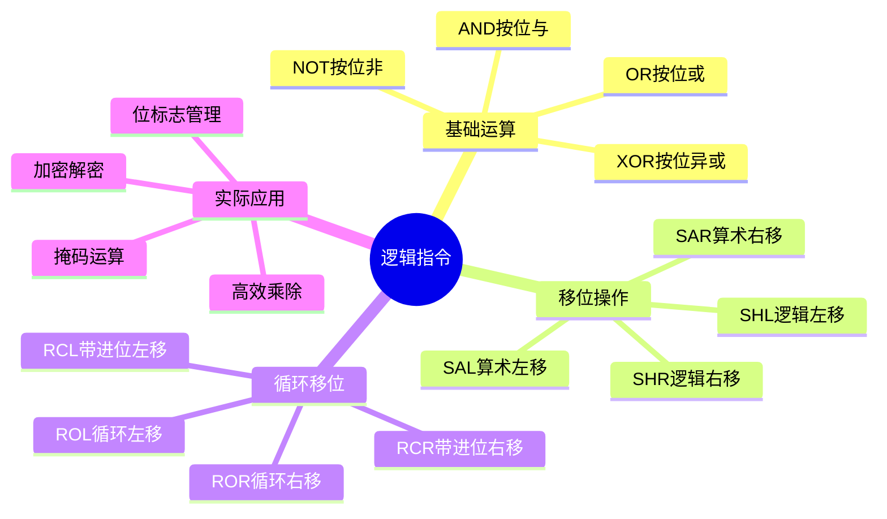
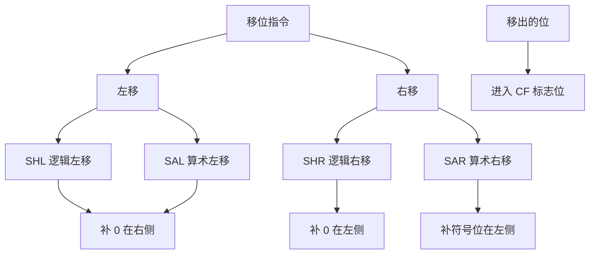
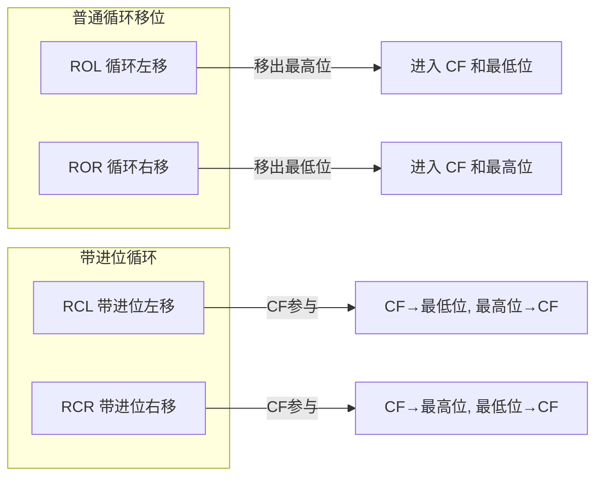
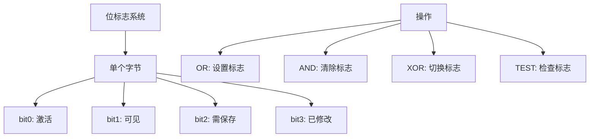

---
title: 汇编语言逻辑指令
created: 2026-05-17
updated: 2026-05-17
categories: [汇编语言, 核心概念, 指令集]
categoryPath: "汇编语言/核心概念/指令集"
tags: [汇编语言, x86, 逻辑指令, 位运算, AND, OR, XOR, NOT, 移位]
sources: [raw/articles/汇编语言逻辑指令.md]
confidence: high
diagramized: true
diagramizedAt: 2026-05-17
---

# 汇编语言逻辑指令

## 概述

**定义**：逻辑指令是 CPU 执行位级操作的基础指令，用于对二进制位进行精确控制。这些指令在系统编程、底层优化、位标志管理等场景中极为常用。

逻辑指令主要分为三类：
1. **基础逻辑运算**：AND、OR、NOT、XOR
2. **移位操作**：SHL、SHR、SAL、SAR
3. **循环移位**：ROL、ROR、RCL、RCR



---

## 基础逻辑运算

### AND - 按位与

**定义**：`AND` 对两个操作数逐位执行"与"运算，只有当对应位都为 1 时，结果位才为 1。

**功能**：
- 语法：`and dest, src`
- 执行：`dest = dest & src`
- 影响标志位：CF=0、OF=0、ZF、SF、PF

**真值表**：
| A | B | A AND B |
|---|---|---------|
| 0 | 0 | 0       |
| 0 | 1 | 0       |
| 1 | 0 | 0       |
| 1 | 1 | 1       |

**常用场景**：
1. **位掩码**：保留特定位，清除其他位
2. **判断奇偶**：和 1 做 AND 看最低位
3. **字节提取**：从 16 位或 32 位数据中提取一个字节

**示例代码**：
```nasm
; 文件路径：and_demo.asm
; AND 指令示例

section .text
global _start

_start:
; 基本按位与
mov eax, 0x0F0F    ; 0000 1111 0000 1111
and eax, 0x00FF    ; 0000 0000 1111 1111
; 结果：eax = 0x000F  ; 0000 0000 0000 1111

; 技巧1：屏蔽低 4 位（保留低 4 位）
mov eax, 0xAB      ; 1010 1011
and eax, 0x0F      ; 0000 1111
; eax = 0x0B        ; 0000 1011

; 技巧2：判断奇偶性（和 1 做 AND）
mov eax, 42        ; 偶数
and eax, 1         ; eax = 0（偶数）
; 42 的二进制末尾是 0，42 & 1 = 0

mov eax, 43        ; 奇数
and eax, 1         ; eax = 1（奇数）
; 43 的二进制末尾是 1，43 & 1 = 1

; 技巧3：将寄存器清零
xor eax, eax       ; 等同于 mov eax, 0，但更快更短

; AND 会设置标志位：CF=0, OF=0, ZF 和 SF 根据结果
mov eax, 1
mov ebx, 0
int 0x80
```

---

### OR - 按位或

**定义**：`OR` 对两个操作数逐位执行"或"运算，只要有一个位为 1，结果位就为 1。

**功能**：
- 语法：`or dest, src`
- 执行：`dest = dest | src`
- 影响标志位：CF=0、OF=0、ZF、SF、PF

**真值表**：
| A | B | A OR B |
|---|---|--------|
| 0 | 0 | 0      |
| 0 | 1 | 1      |
| 1 | 0 | 1      |
| 1 | 1 | 1      |

**常用场景**：
1. **设置特定位**：将某些位强制设为 1
2. **合并标志**：将多个标志位合并成一个值
3. **大小写转换**：ASCII 码的大小写转换（第 5 位）

**示例代码**：
```nasm
; OR 指令示例

; 合并标志位
mov eax, 0x0F00    ; 0000 1111 0000 0000
or eax, 0x00FF     ; 0000 0000 1111 1111
; eax = 0x0FFF     ; 0000 1111 1111 1111

; 设置某个位（把第 3 位设为 1）
mov eax, 0         ; 0000 0000
or eax, 0x08       ; 0000 1000
; eax = 0x8        ; 0000 1000

; 大小写转换：大写转小写
mov al, 'A'        ; al = 0x41 (0100 0001)
or al, 0x20        ; 0x20 = 0010 0000
; al = 0x61 = 'a'  ; 0110 0001
```

---

### NOT - 按位取反

**定义**：`NOT` 将操作数的每个位取反（0 变 1，1 变 0）。

**功能**：
- 语法：`not dest`
- 执行：`dest = ~dest`
- **不影响任何标志位**（这是与其他逻辑指令的重要区别）

**特点**：NOT 是一元操作符，只对一个操作数进行操作。

**示例代码**：
```nasm
; NOT 指令示例

mov eax, 0x0F0F0F0F  ; 0000 1111 0000 1111 ...
not eax              ; 1111 0000 1111 0000 ...
; eax = 0xF0F0F0F0

; NOT 不影响任何标志位（与 AND/OR/XOR 不同）
```

---

### XOR - 按位异或

**定义**：`XOR` 对两个操作数逐位执行"异或"运算，只有当两个位不同时结果为 1。

**功能**：
- 语法：`xor dest, src`
- 执行：`dest = dest ^ src`
- 影响标志位：CF=0、OF=0、ZF、SF、PF

**真值表**：
| A | B | A XOR B |
|---|---|---------|
| 0 | 0 | 0       |
| 0 | 1 | 1       |
| 1 | 0 | 1       |
| 1 | 1 | 0       |

**经典技巧**：
1. **寄存器清零**：`xor eax, eax`（比 `mov eax, 0` 更高效）
2. **交换两个值**：不需要临时变量
3. **简单加密**：两次 XOR 恢复原值

**示例代码**：
```nasm
; 文件路径：xor_demo.asm
; XOR 指令示例

section .text
global _start

_start:
; 基本异或
mov eax, 0x0F0F    ; 0000 1111 0000 1111
xor eax, 0x00FF    ; 0000 0000 1111 1111
; 结果：eax = 0x0FF0  ; 0000 1111 1111 0000

; 技巧1：寄存器清零（比 mov reg, 0 高效）
xor eax, eax       ; eax = 0，只占用 2 字节
xor ebx, ebx
xor ecx, ecx

; 技巧2：交换两个寄存器（不需要第三个临时寄存器）
mov eax, 100       ; eax = 100
mov ebx, 200       ; ebx = 200
xor eax, ebx       ; eax = 100 xor 200
xor ebx, eax       ; ebx = 200 xor (100 xor 200) = 100
xor eax, ebx       ; eax = (100 xor 200) xor 100 = 200
; 现在 eax = 200, ebx = 100（交换完成！）

; 技巧3：简单的加密/解密
mov al, 'A'        ; 原始字符 'A' = 0x41
xor al, 0x55       ; 加密：al = 'A' xor 0x55
; al 现在是某个乱码值
xor al, 0x55       ; 解密：再 xor 0x55 恢复
; al = 'A' 回来了！

mov eax, 1
mov ebx, 0
int 0x80
```

> **注意**：XOR 交换技巧虽然很酷，但在现代 CPU 上效率不如使用 `XCHG` 指令或临时寄存器。了解即可，不必执着使用。

---

## 移位指令

**定义**：移位指令将二进制位向左或向右移动，常用于高效的乘除运算（乘以或除以 2 的幂）。



### 移位指令速查表

| 指令 | 功能 | 示例 | 效果 |
|-----|------|-----|------|
| SHL | 逻辑左移（左边出去，右边补 0） | `shl eax, 1` | 乘以 2 |
| SHR | 逻辑右移（右边出去，左边补 0） | `shr eax, 1` | 无符号除以 2 |
| SAL | 算术左移（同 SHL） | `sal eax, 1` | 乘以 2 |
| SAR | 算术右移（右边出去，左边保持符号位） | `sar eax, 1` | 有符号除以 2 |

### 移位指令详解

**SHL/SAL - 逻辑/算术左移**
- 功能：将位向左移动，右边补 0
- 效果：等同于无符号数乘以 2
- 移出的位进入 CF 标志位

**SHR - 逻辑右移**
- 功能：将位向右移动，左边补 0
- 效果：等同于无符号数除以 2
- 移出的位进入 CF 标志位

**SAR - 算术右移**
- 功能：将位向右移动，左边保持符号位
- 效果：等同于有符号数除以 2
- 移出的位进入 CF 标志位

**示例代码**：
```nasm
; 文件路径：shift_demo.asm
; 移位指令示例

section .text
global _start

_start:
; SHL：逻辑左移 = 乘以 2 的幂
mov eax, 10        ; eax = 10 (1010)
shl eax, 1         ; eax = 20 (10100)，即 10×2
shl eax, 2         ; eax = 80 (1010000)，即 20×4

; SHR：逻辑右移 = 无符号除以 2 的幂
mov eax, 80        ; eax = 80
shr eax, 3         ; eax = 10，即 80÷8

; SAR：算术右移 = 有符号除以 2 的幂（保留符号位）
mov eax, -16       ; eax = -16 (0xFFFFFFF0)
sar eax, 2         ; eax = -4 (0xFFFFFFFC)，即 -16÷4
; SAR 对比 SHR：
; 如果 eax = 0xFFFFFFF0 (-16)，SHR 会得到 0x3FFFFFFC (很大的正数)
; 而 SAR 会得到 0xFFFFFFFC (-4)，保留了符号位

; 移出的最后一位会进入 CF 标志位
mov eax, 5         ; 0101
shr eax, 1         ; eax = 2, CF = 1（末尾的 1 被移出）
jc carry_was_set   ; 如果 CF=1，说明原数是奇数

carry_was_set:
mov eax, 1
mov ebx, 0
int 0x80
```

---

## 循环移位指令

**定义**：循环移位将移出的位重新填入另一端，形成循环。



### 循环移位速查表

| 指令 | 功能 | 说明 |
|-----|------|------|
| ROL | 循环左移（绕过 CF） | 移出的最高位进入最低位和 CF |
| ROR | 循环右移（绕过 CF） | 移出的最低位进入最高位和 CF |
| RCL | 带进位的循环左移（通过 CF） | CF 参与循环，数据和 CF 一起旋转 |
| RCR | 带进位的循环右移（通过 CF） | CF 参与循环，数据和 CF 一起旋转 |

**示例代码**：
```nasm
; 循环移位示例

; ROL：循环左移
mov al, 0x85       ; 1000 0101
rol al, 1          ; 左移 1 位：0000 1011
; CF = 1（最高位移出到 CF）
; 同时 CF 原本的 1 被移入最低位，形成循环

; ROL 实际效果：向左移 1 位，最高位同时进入 CF 和最低位
; 1000 0101 -> ROL 1 -> 0000 1011

; RCL：带进位循环左移（CF 参与循环）
clc                ; 清除 CF = 0
mov al, 0x85       ; 1000 0101
rcl al, 1          ; CF 参与：CF bit7...bit0 -> CF
; 结果：0000 1010, CF = 1

; 循环移位在加密算法和位操作中常用
```

---

## 逻辑运算的实际应用

### 位标志系统

位标志是逻辑运算最常见的应用场景之一。通过使用单个字节或字的不同位来表示多个布尔状态，可以大大节省存储空间并提高效率。



**综合示例代码**：
```nasm
; 文件路径：bit_flags.asm
; 使用逻辑运算实现位标志系统

section .data
flags db 0          ; 8 个标志位，初始全为 0
; bit0: 是否激活
; bit1: 是否可见
; bit2: 是否需要保存
; bit3: 是否已修改

FLAG_ACTIVE   equ 1  ; 0000 0001
FLAG_VISIBLE  equ 2  ; 0000 0010
FLAG_NEED_SAVE equ 4 ; 0000 0100
FLAG_MODIFIED equ 8  ; 0000 1000

section .text
global _start

_start:
; 设置标志位：OR
mov al, [flags]
or al, FLAG_ACTIVE   ; 设置 bit0
or al, FLAG_VISIBLE  ; 设置 bit1
; al = 0000 0011 = 3
mov [flags], al

; 检查标志位：AND + TEST
test byte [flags], FLAG_ACTIVE  ; 测试 bit0 是否为 1
jnz is_active       ; ZF=0 表示该位是 1

is_active:
; 清除标志位：AND + NOT
mov al, [flags]
and al, ~FLAG_VISIBLE  ; 清除 bit1（保留其他位不变）
; al = 0000 0001 = 1
mov [flags], al

; 切换标志位：XOR
mov al, [flags]
xor al, FLAG_MODIFIED  ; 切换 bit3
; 如果原来是 0 变成 1，原来是 1 变成 0

mov eax, 1
mov ebx, 0
int 0x80
```

> **位标志操作在系统编程中极为常见**。操作系统内核、设备驱动和嵌入式系统中广泛使用这种技巧来管理状态。

---

## 逻辑指令速查表

| 指令 | 格式 | 功能 | 影响的标志位 |
|-----|-----|
| AND | `and dest, src` | `dest = dest & src` | CF=0, OF=0, ZF, SF, PF |
| OR | `or dest, src` | `dest = dest \| src` | CF=0, OF=0, ZF, SF, PF |
| NOT | `not dest` | `dest = ~dest` | 无 |
| XOR | `xor dest, src` | `dest = dest ^ src` | CF=0, OF=0, ZF, SF, PF |
| SHL | `shl dest, count` | 左移，右边补 0 | CF, ZF, SF, OF, PF |
| SHR | `shr dest, count` | 右移，左边补 0 | CF, ZF, SF, OF, PF |
| SAL | `sal dest, count` | 同 SHL | CF, ZF, SF, OF, PF |
| SAR | `sar dest, count` | 右移，左边保符号位 | CF, ZF, SF, OF, PF |
| ROL | `rol dest, count` | 循环左移 | CF, OF |
| ROR | `ror dest, count` | 循环右移 | CF, OF |
| RCL | `rcl dest, count` | 带进位循环左移 | CF, OF |
| RCR | `rcr dest, count` | 带进位循环右移 | CF, OF |

---

## 相关概念

- [[汇编语言算术指令]] - 了解算术运算指令
- [[汇编语言寄存器]] - 了解 x86 架构的寄存器
- [[汇编语言内存分段]] - 了解内存访问方式
- [[汇编语言系统调用]] - 了解如何进行系统调用

---

## 参考资料

- 菜鸟教程 - https://www.runoob.com/assembly/assembly-logic.html
