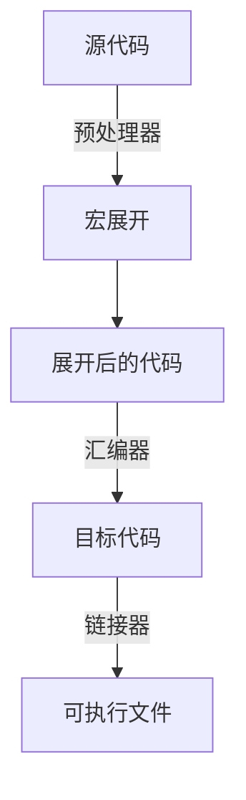
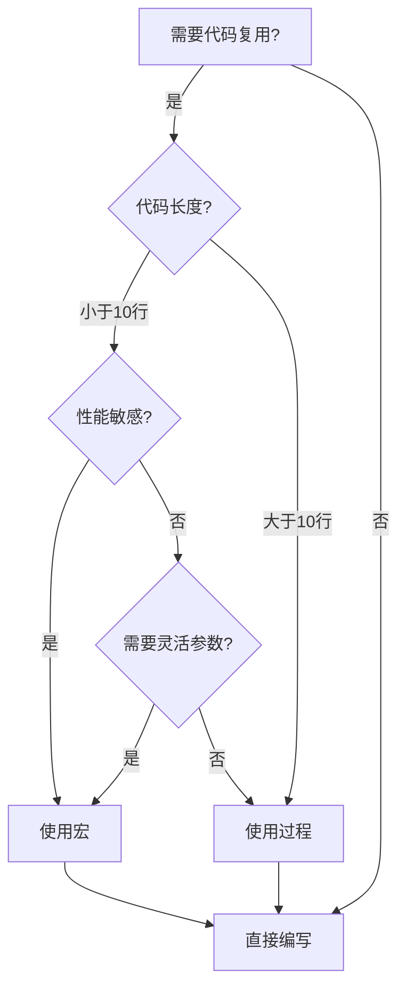

---
title: 汇编语言宏
created: 2026-05-17
updated: 2026-05-17
categories: [汇编语言, 高级主题, 宏与汇编器]
categoryPath: "汇编语言/高级主题/宏与汇编器"
tags: [NASM, 宏, 代码复用]
sources: [raw/articles/汇编语言宏.md]
confidence: high
diagramized: true
diagramizedAt: 2026-05-17
---

# 汇编语言宏

宏（Macro）是 NASM 提供的一种强大的代码复用机制，它允许你在编译时展开代码模板，减少重复编写相似代码的需求。

## 概述

宏是一种**编译时文本替换机制**，由汇编器的预处理器在编译前展开。与过程（Procedure）不同，宏不会有 CALL/RET 开销——每次使用宏时，编译器直接将宏的内容复制到使用位置。

### 宏展开过程



### 宏与过程的核心区别

| 特性   | 宏（Macro）         | 过程（Procedure）          |
| ---- | ---------------- | ---------------------- |
| 实现方式 | 编译时文本展开          | 运行时 CALL/RET           |
| 执行开销 | 无调用开销（直接内联）      | 有 CALL/RET 开销（约几个时钟周期） |
| 代码大小 | 每次展开增加体积         | 一份代码多次调用               |
| 参数类型 | 任意文本（寄存器、立即数、内存） | 运行时值                   |
| 调试   | 难（展开后无痕迹）        | 易（有函数调用栈）              |
| 适用场景 | 短小频繁调用、类型灵活的代码   | 复杂逻辑、代码量大的函数           |

### 选择宏还是过程



- **使用宏**：代码短小、频繁调用、需要灵活的参数类型
- **使用过程**：代码复杂、代码量大、需要更好的调试支持

> 过度使用宏会让代码难以阅读和调试。当宏体超过 10 行时，考虑改为过程调用。在性能敏感的热路径中，短小宏的内联效果才有明显好处。

## 单行宏：%define

`%define` 是最简单的宏形式，用于单行文本替换。

### 基本用法

```nasm
; 定义常量
%define MAX_SIZE 256
%define APP_NAME 'runoob'

section .text
global _start

_start:
    mov eax, MAX_SIZE    ; 展开为 mov eax, 256
```

### 带参数的宏

`%define` 也可以定义带参数的宏，类似高级语言中的函数：

```nasm
%define mul_by_2(x) (x * 2)
%define sum3(a, b, c) ((a) + (b) + (c))

section .text
global _start

_start:
    mov eax, mul_by_2(10)      ; 展开为 mov eax, (10 * 2) = 20
    mov eax, sum3(1, 2, 3)     ; 展开为 mov eax, ((1)+(2)+(3)) = 6
```

### 重要注意事项

`%define` 宏展开时是**纯文本替换**，这可能导致运算符优先级问题：

```nasm
%define mul_by_2(x) x * 2

; 危险！
mov eax, mul_by_2(2+3)  ; 展开为 2+3 * 2，由于运算符优先级，结果是 8 而不是 10

; 安全的做法：给参数加括号
%define mul_by_2(x) (x * 2)
```

### 重新定义和取消定义

```nasm
%define MAX_SIZE 256
mov eax, MAX_SIZE    ; eax = 256

; 重新定义
%define MAX_SIZE 512
mov eax, MAX_SIZE    ; eax = 512

; 取消定义
%undef MAX_SIZE
; mov eax, MAX_SIZE  ; 错误：MAX_SIZE 未定义
```

## 多行宏：%macro / %endmacro

对于包含多条指令的复杂宏，使用 `%macro` 和 `%endmacro` 来定义。

### 基本语法

```nasm
%macro 宏名 参数个数
    ; 宏体
    ; 使用 %1, %2, ... 引用参数
%endmacro
```

### 实例：退出程序宏

```nasm
; 宏定义：退出程序
; 接受 1 个参数：退出码
%macro exit_program 1
    mov eax, 1          ; sys_exit
    mov ebx, %1         ; 第 1 个参数作为退出码
    int 0x80
%endmacro

section .text
global _start

_start:
    exit_program 0      ; 展开为退出程序的代码
```

### 实例：打印字符串宏

```nasm
; 宏定义：打印字符串
; 接受 2 个参数：字符串地址、长度
%macro print_string 2
    push eax
    push ebx
    push ecx
    push edx
    mov eax, 4          ; sys_write
    mov ebx, 1          ; stdout
    mov ecx, %1         ; 字符串地址
    mov edx, %2         ; 字符串长度
    int 0x80
    pop edx
    pop ecx
    pop ebx
    pop eax
%endmacro

section .data
    msg db 'Hello, RUNOOB!', 0xA
    msg_len equ $ - msg

section .text
global _start

_start:
    print_string msg, msg_len    ; 使用宏打印消息
    print_string msg, msg_len    ; 再次调用
    exit_program 0
```

## 宏参数的高级用法

NASM 宏支持默认参数、参数计数和条件展开等高级特性。

### 带默认参数的宏

```nasm
; 带默认参数的宏（参数范围 2-3）
; 第 3 个参数默认值为 1
%macro debug_print 2-3 1
    %if %3 = 1          ; 如果第 3 个参数 = 1（debug 模式开启）
        push eax
        push ebx
        push ecx
        push edx
        mov eax, 4
        mov ebx, 1
        mov ecx, %1
        mov edx, %2
        int 0x80
        pop edx
        pop ecx
        pop ebx
        pop eax
    %endif
%endmacro

section .data
    debug_msg db 'Debug info', 0xA
    debug_len equ $ - debug_msg

section .text
global _start

_start:
    debug_print debug_msg, debug_len, 1    ; 开启调试输出
    debug_print debug_msg, debug_len, 0    ; 关闭调试输出
    debug_print debug_msg, debug_len       ; 使用默认值 1
```

### 不定数量参数的宏

```nasm
; 不定数量参数的宏
%macro push_registers 1-*
    %rep %0            ; %0 是参数个数
        push %1        ; 展开第 1 个参数
        %rotate 1      ; 向左旋转参数列表
    %endrep
%endmacro

section .text
global _start

_start:
    ; 使用 push_registers 保存多个寄存器
    push_registers eax, ebx, ecx, edx
    ; 展开为：
    ; push eax
    ; push ebx
    ; push ecx
    ; push edx

    ; 对应地弹出
    pop edx
    pop ecx
    pop ebx
    pop eax
```

## 宏中的局部标签

在宏中使用普通标签会导致多次展开时标签冲突，需要使用局部标签。

### 问题演示

```nasm
; 错误的做法
%macro min_val 2
    mov eax, %1
    mov ebx, %2
    cmp eax, ebx
    jle skip            ; 多次展开会导致 skip 标签重名错误
    mov eax, ebx
skip:
%endmacro

section .text
_start:
    min_val 10, 5       ; 第一次展开，定义 skip 标签
    min_val eax, 3      ; 第二次展开，skip 标签重名！错误
```

### 使用局部标签

使用 `%%label` 语法定义局部标签，NASM 每次展开都会生成唯一的标签名：

```nasm
; 正确的做法：使用局部标签
%macro min_val 2
    mov eax, %1
    mov ebx, %2
    cmp eax, ebx
    jle %%skip          ; ★ 局部标签，每次展开会生成唯一名
    mov eax, ebx
%%skip:
%endmacro

section .text
global _start

_start:
    min_val 10, 5       ; eax = 5，标签名类似 ..@0001.skip
    min_val eax, 3      ; eax = 3，标签名类似 ..@0002.skip
```

## 条件编译：%if / %elif / %else / %endif

宏预处理器支持条件编译，可以根据符号定义选择生成不同的代码。

### 调试/发布模式切换

```nasm
%define DEBUG 1    ; 1=调试模式, 0=发布模式

section .data
    msg db 'Program running...', 0xA
    msg_len equ $ - msg
    debug_msg db '[DEBUG] Entering function', 0xA
    debug_len equ $ - debug_msg

section .text
global _start

_start:
    %if DEBUG = 1
        ; 调试模式：输出调试信息
        mov eax, 4
        mov ebx, 1
        mov ecx, debug_msg
        mov edx, debug_len
        int 0x80
    %endif

    ; 正常业务逻辑
    mov eax, 4
    mov ebx, 1
    mov ecx, msg
    mov edx, msg_len
    int 0x80

    mov eax, 1
    mov ebx, 0
    int 0x80
```

### 条件编译常用场景

| 场景      | 示例                            |
| ------- | ----------------------------- |
| 调试/发布切换 | %if DEBUG / %else / %endif    |
| 平台适配    | %ifdef LINUX / %ifdef WINDOWS |
| 功能开关    | 通过符号存在与否控制特性                  |

## %rep 重复块

`%rep` 用于生成重复的代码或数据。

### 基本用法

```nasm
section .text
global _start

_start:
    ; %rep 在代码中重复指令
    mov eax, 0
    %rep 5              ; 重复 5 次
        inc eax         ; eax 每次加 1
    %endrep
    ; eax = 5

    mov ebx, eax
    mov eax, 1
    int 0x80
```

### 生成数据

```nasm
section .data
    ; 生成 0-9 的 ASCII 表
    digits: db '0', '1', '2', '3', '4', '5', '6', '7', '8', '9'
```

注意：`%rep` 主要用于简单重复，复杂计算需要其他方式。

## 宏的最佳实践

1. **保持简短**：宏体超过 10 行考虑改为过程
2. **参数加括号**：避免运算符优先级问题
3. **使用局部标签**：避免多次展开时标签冲突
4. **保存和恢复寄存器**：宏中修改的寄存器要记得保存和恢复
5. **添加注释**：宏定义要添加清晰的注释说明用途和参数
6. **适度使用**：不要过度使用宏，保持代码可读性

## 相关概念

- [[汇编语言/入门教程/汇编语言过程]] - 过程（函数）的使用，与宏对比
- [[汇编语言/入门教程/汇编语言常量]] - 常量定义，与 `%define` 相关
- [[汇编语言/入门教程/汇编语言基础语法]] - NASM 基础语法

## 参考资料

- 来源：[汇编语言 - 宏](https://www.runoob.com/assembly/assembly-macro.html)
