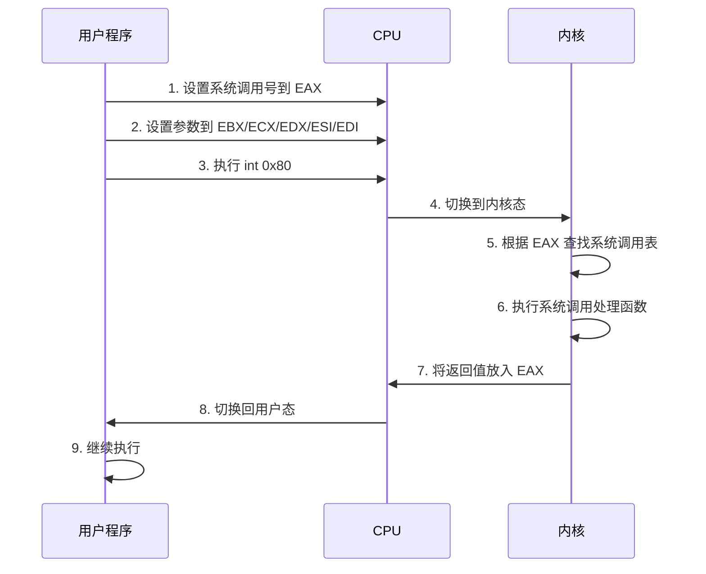
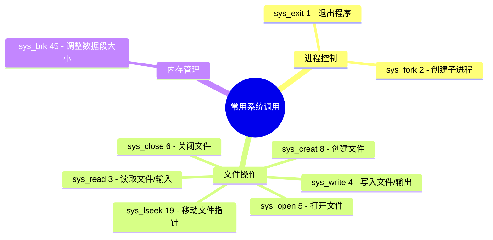
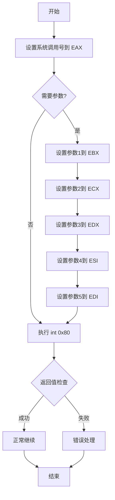

---
title: 汇编语言系统调用
created: 2026-05-17
updated: 2026-05-17
categories: [汇编语言, 高级主题, 系统调用]
categoryPath: "汇编语言/高级主题/系统调用"
tags: [汇编, 系统调用, Linux, int 0x80]
sources: [raw/articles/汇编语言系统调用.md]
confidence: high
diagramized: true
diagramizedAt: 2026-05-17
---

# 汇编语言系统调用

系统调用（System Call）是用户程序与操作系统内核交互的唯一途径。通过系统调用，汇编程序可以读写文件、分配内存、创建进程等。

## 概述

### 什么是系统调用

用户程序运行在受限的用户态（User Mode），无法直接访问硬件或执行特权操作。

当程序需要执行 IO 操作、内存分配等内核级功能时，必须通过系统调用向操作系统内核请求服务。

系统调用的流程是：用户程序发起系统调用 → CPU 切换到内核态 → 内核执行对应服务 → 返回用户态继续执行。

> 可以把系统调用理解为：**用户程序给操作系统打个电话，请求帮忙做一件自己没有权限做的事情。**

---

## Linux 系统调用机制

在 Linux 32 位系统中，系统调用通过以下步骤完成：

1. 将系统调用号放入 **EAX** 寄存器
2. 将参数放入 **EBX、ECX、EDX、ESI、EDI** 等寄存器
3. 执行 `int 0x80` 指令触发软件中断
4. CPU 切换到内核态，内核根据 EAX 中的调用号执行对应服务
5. 内核将返回值放入 EAX，切换回用户态继续执行



---

## 常用系统调用一览



| 系统调用 | 调用号（EAX） | 功能 | 参数 |
| --- | --- | --- | --- |
| sys_exit | 1 | 退出程序 | EBX = 返回值（exit code） |
| sys_fork | 2 | 创建子进程 | 无参数 |
| sys_read | 3 | 读取文件/输入 | EBX=fd, ECX=buf, EDX=count |
| sys_write | 4 | 写入文件/输出 | EBX=fd, ECX=buf, EDX=count |
| sys_open | 5 | 打开文件 | EBX=filename, ECX=flags, EDX=mode |
| sys_close | 6 | 关闭文件 | EBX=fd |
| sys_creat | 8 | 创建文件 | EBX=filename, ECX=mode |
| sys_lseek | 19 | 移动文件指针 | EBX=fd, ECX=offset, EDX=whence |
| sys_brk | 45 | 调整数据段大小（内存分配） | EBX=新地址 |

> 完整的系统调用列表可在 `/usr/include/asm/unistd_32.h` 中查看。注意 32 位和 64 位的系统调用号不同。

---

## sys_write - 输出字符串

最常用的系统调用，用于向屏幕打印内容。

### 示例代码

```nasm
; 文件路径：write_syscall.asm
; 使用 sys_write 输出字符串

section .data
    msg db 'Hello, runoob! Welcome to assembly.', 0xA
    len equ $ - msg

section .text
global _start

_start:
    ; 调用 sys_write (4)
    mov eax, 4          ; 系统调用号 4 = sys_write
    mov ebx, 1          ; 文件描述符 1 = stdout（标准输出）
    mov ecx, msg        ; 要输出的数据地址
    mov edx, len        ; 数据长度（字节数）
    int 0x80            ; 触发系统调用

    ; 成功时 EAX 返回实际写入的字节数

    ; 退出程序
    mov eax, 1
    mov ebx, 0
    int 0x80
```

### 编译运行

```bash
$ nasm -f elf32 write_syscall.asm -o write_syscall.o
$ ld -m elf_i386 write_syscall.o -o write_syscall
$ ./write_syscall
Hello, runoob! Welcome to assembly.
```

---

## sys_read - 读取用户输入

从标准输入（键盘）读取数据。

### 示例代码

```nasm
; 文件路径：read_syscall.asm
; 使用 sys_read 读取用户输入并回显

section .bss
    buffer resb 64      ; 预留 64 字节输入缓冲区

section .data
    prompt db 'Please enter your name: '
    prompt_len equ $ - prompt
    output_msg db 'Hello, '
    output_msg_len equ $ - output_msg

section .text
global _start

_start:
    ; 输出提示信息
    mov eax, 4
    mov ebx, 1
    mov ecx, prompt
    mov edx, prompt_len
    int 0x80

    ; 读取用户输入
    mov eax, 3          ; 系统调用号 3 = sys_read
    mov ebx, 0          ; 文件描述符 0 = stdin（标准输入）
    mov ecx, buffer     ; 输入缓冲区地址
    mov edx, 64         ; 最多读取 64 字节
    int 0x80

    ; EAX 返回实际读取的字节数（包含末尾的换行符）
    mov esi, eax        ; 保存实际输入长度到 esi

    ; 输出 "Hello, "
    mov eax, 4
    mov ebx, 1
    mov ecx, output_msg
    mov edx, output_msg_len
    int 0x80

    ; 输出用户输入的内容
    mov eax, 4
    mov ebx, 1
    mov ecx, buffer
    mov edx, esi        ; 使用实际输入的字节数
    int 0x80

    ; 退出程序
    mov eax, 1
    mov ebx, 0
    int 0x80
```

### 编译运行

```bash
$ nasm -f elf32 read_syscall.asm -o read_syscall.o
$ ld -m elf_i386 read_syscall.o -o read_syscall
$ ./read_syscall
Please enter your name: runoob
Hello, runoob
```

---

## sys_exit - 退出程序

每个程序都必须调用 sys_exit 来正常退出，否则 CPU 会继续执行后面的垃圾数据导致段错误。

### 示例代码

```nasm
; 使用不同退出码退出

mov eax, 1          ; 系统调用号 1 = sys_exit
mov ebx, 0          ; 退出码 0 = 正常退出（也可以是非零值）
int 0x80
```

### 查看退出码

退出码可以在 shell 中通过 `$?` 查看：

```bash
$ ./program
$ echo $?
0
```

---

## 系统调用通用模板

编写系统调用时，可以遵循以下通用模板：



```nasm
; 系统调用通用模板
; 适用于 Linux 32 位系统

; 步骤1：将系统调用号放入 EAX
mov eax, 系统调用号

; 步骤2：按顺序放入参数
mov ebx, 第1个参数
mov ecx, 第2个参数
mov edx, 第3个参数
mov esi, 第4个参数
mov edi, 第5个参数

; 步骤3：触发系统调用
int 0x80

; 步骤4：检查返回值（在 EAX 中）
; 通常负值表示错误
cmp eax, 0
jl error_handler     ; 如果 EAX < 0，跳转到错误处理
```

> `int 0x80` 触发后，EAX 存放返回值。大多数系统调用成功时返回非负值，失败时返回负的错误码（如 -1 表示 EPERM）。

---

## 相关概念

- [[汇编语言寄存器]]
- [[汇编语言基础语法]]
- [[栈介绍]]
- [[C语言函数调用栈（一）]]
