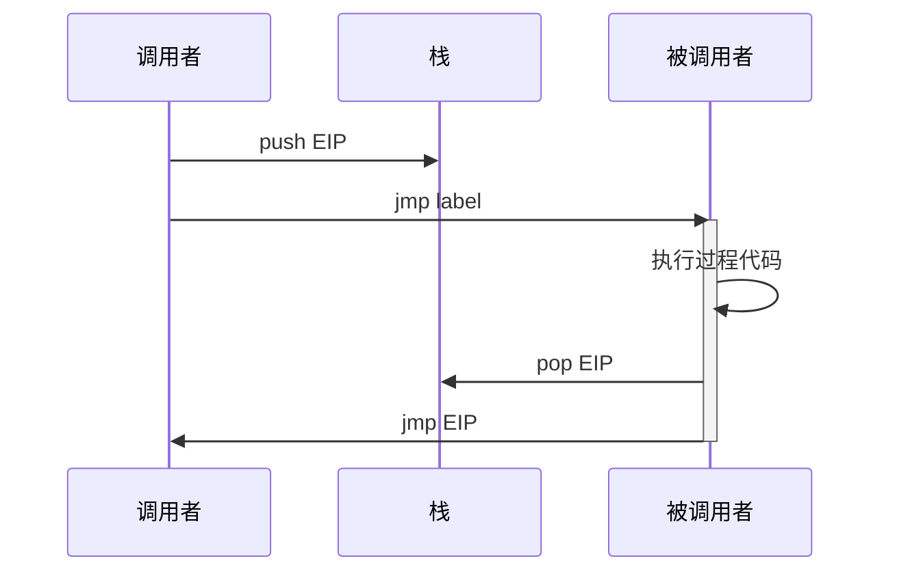
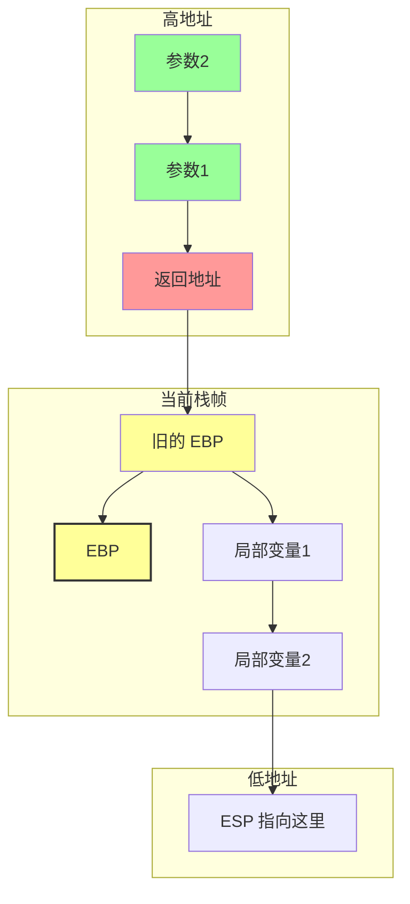
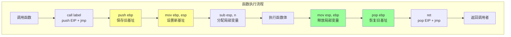
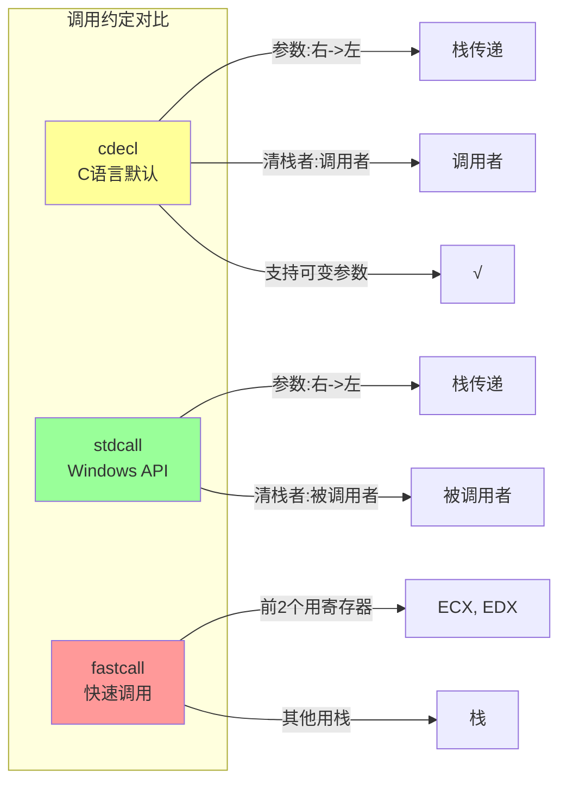

---
title: 汇编语言过程
created: 2026-05-17
updated: 2026-05-17
categories: [汇编语言, 高级主题, 过程与函数]
categoryPath: "汇编语言/高级主题/过程与函数"
tags: [汇编, 过程, 函数, 栈帧]
sources: [raw/articles/汇编语言过程.md]
confidence: high
diagramized: true
diagramizedAt: 2026-05-17
---

# 汇编语言过程

过程（Procedure）是汇编语言中实现函数/子程序复用的机制，它能让代码结构化、可重用。理解过程和栈的关系是汇编编程的重要里程碑。

## 概述

过程是一段可以被多次调用的代码块，类似于高级语言中的函数（Function）或子程序（Subroutine）。

在汇编中，过程通过 `CALL` 指令调用，通过 `RET` 指令返回。`CALL` 会将返回地址压入栈中，`RET` 从栈中弹出返回地址并跳转回去。

过程的核心价值：
- 代码复用
- 结构化编程
- 模块化设计
- 易于维护

## 什么是过程

过程是组织代码的基本单位。

### 最简单的过程示例

```nasm
; 文件路径：simple_proc.asm
; 最简单的过程调用示例

section .data
msg db 'Hello, runoob!', 0xA
len equ $ - msg

section .text
global _start

_start:
    call print_message       ; 调用过程（将下条指令地址压栈）
    call print_message       ; 再次调用
    
    mov eax, 1
    mov ebx, 0
    int 0x80

; 过程：打印消息
print_message:
    push eax                 ; 保存要修改的寄存器
    push ebx
    push ecx
    push edx
    
    mov eax, 4
    mov ebx, 1
    mov ecx, msg
    mov edx, len
    int 0x80
    
    pop edx                  ; 恢复寄存器（按相反顺序）
    pop ecx
    pop ebx
    pop eax
    ret                      ; 返回调用处（从栈中弹出返回地址）
```

### 寄存器保存礼仪

在过程内部，应当保存和恢复所有被修改的寄存器（除了 EAX 当返回值时）。这是汇编编程的基本礼仪。

不这样做会导致：
- 调用方的寄存器值被意外修改
- 难以调试的 bug
- 代码不可预测的行为

## CALL 和 RET 原理

`CALL` 和 `RET` 配对工作，依赖栈来管理返回地址。



### 指令详解

| 指令         | 实际执行的操作                        |
| ---------- | ------------------------------ |
| CALL label | push eip（保存下一条指令地址）+ jmp label |
| RET        | pop eip（从栈中弹出地址并跳转）            |

### 执行流程

1. `CALL label` 执行时：
   - 将下一条指令的地址压入栈
   - 跳转到 label
   
2. `RET` 执行时：
   - 从栈顶弹出地址
   - 跳转到该地址继续执行

## 通过寄存器传递参数

在调用过程前将参数放入约定好的寄存器。

### 寄存器传参示例

```nasm
; 文件路径：proc_params_reg.asm
; 通过寄存器传递参数

section .data
newline db 0xA

section .text
global _start

_start:
    ; 调用 add_two 过程：计算 10 + 20
    mov eax, 10                ; 第一个参数放在 eax
    mov ebx, 20                ; 第二个参数放在 ebx
    call add_two               ; 调用过程
    ; 返回值在 eax 中 = 30
    
    mov ebx, eax               ; 退出码 = 30
    mov eax, 1
    int 0x80

; 过程：计算 eax + ebx，结果返回在 eax 中
add_two:
    add eax, ebx               ; eax = eax + ebx
    ret
```

### 寄存器传参的优缺点

优点：
- 速度快（不涉及内存操作）
- 简单直接

缺点：
- 寄存器数量有限
- 不适合大量参数
- 需要约定好哪个寄存器放什么

## 通过栈传递参数

栈传递参数更灵活，是 C 语言等高级语言的标准方式。

### 栈传参示例（cdecl 风格）

```nasm
; 文件路径：proc_params_stack.asm
; 通过栈传递参数（cdecl 风格）

section .data
msg db 'Sum is: '
msg_len equ $ - msg
newline db 0xA

section .bss
result_buf resb 4

section .text
global _start

_start:
    ; 调用 sum 过程：计算 100 + 200
    push dword 200             ; 压入第 2 个参数
    push dword 100             ; 压入第 1 个参数
    call sum                   ; 调用过程
    add esp, 8                 ; ★ 调用者清理栈（cdecl 约定）
    ; 返回值在 eax 中 = 300
    
    mov ebx, eax
    mov eax, 1
    int 0x80

; 过程：sum(a, b) = a + b
sum:
    push ebp                   ; ★ 保存旧的基址指针
    mov ebp, esp               ; ★ 设置新的栈帧基址
    
    ; 栈布局（从高地址到低地址）：
    ; [ebp+12] = 参数 b（200）
    ; [ebp+8]  = 参数 a（100）
    ; [ebp+4]  = 返回地址
    ; [ebp]    = 旧的 ebp
    ; [ebp-4]  = 局部变量空间
    
    mov eax, [ebp + 8]         ; 获取第 1 个参数（a）
    add eax, [ebp + 12]        ; 加上第 2 个参数（b）
    
    pop ebp                    ; ★ 恢复旧的基址指针
    ret                        ; 返回
```

### 栈帧结构



```
高地址
+------------------+
| 参数2 (200)      |  &lt;-- [ebp + 12]
+------------------+
| 参数1 (100)      |  &lt;-- [ebp + 8]
+------------------+
| 返回地址          |  &lt;-- [ebp + 4]
+------------------+
| 旧的 EBP         |  &lt;-- [ebp]  (当前 EBP 指向这里)
+------------------+
| 局部变量区        |  &lt;-- [ebp - 4], [ebp - 8], ...
+------------------+  &lt;-- ESP 指向这里
低地址
```

### 函数序言和尾声



函数序言（Prologue）：
```nasm
push ebp
mov ebp, esp
```

函数尾声（Epilogue）：
```nasm
pop ebp
ret
```

或者使用 `leave` 指令简化：
```nasm
leave
ret
```

这是标准的栈帧管理模板，几乎所有汇编函数都以这个结构开始和结束。

## 过程的返回值

返回值通常存放在 EAX 寄存器中（32 位值）或 EDX:EAX（64 位值）。

### 返回值示例

```nasm
; 返回值示例

; 返回 int
call get_answer
; eax = 42

; 返回 64 位值（如 long long）
call get_big_value
; edx:eax = 64 位结果

get_answer:
    mov eax, 42                ; 返回值放在 eax 中
    ret

get_big_value:
    mov eax, 0x00000001        ; 低 32 位
    mov edx, 0x00000000        ; 高 32 位
    ret
```

### 返回值约定

| 数据类型 | 存放位置 |
|---------|---------|
| 32位整数 | EAX |
| 64位整数 | EDX:EAX（EDX放高32位，EAX放低32位） |
| 浮点数 | 通常使用浮点寄存器栈 |

## 局部变量

局部变量使用栈空间，在过程序言中通过减小 ESP 来分配。

### 局部变量示例

```nasm
; 文件路径：local_vars.asm
; 在过程中使用局部变量

section .text
global _start

_start:
    push dword 10
    push dword 20
    call multiply_add
    add esp, 8
    ; eax = 10 * 20 + 10 + 20 = 230
    
    mov ebx, eax
    mov eax, 1
    int 0x80

; 过程：multiply_add(x, y) = x*y + x + y
multiply_add:
    push ebp
    mov ebp, esp
    sub esp, 8                 ; ★ 在栈上分配 8 字节局部变量空间
    
    ; 现在 [ebp-4] 和 [ebp-8] 都是可用的局部变量
    
    mov eax, [ebp + 8]         ; x
    mov ebx, [ebp + 12]        ; y
    
    ; [ebp-4] = x * y
    imul eax, ebx
    mov [ebp - 4], eax         ; 局部变量1 = x * y
    
    ; [ebp-8] = x + y
    mov eax, [ebp + 8]
    add eax, [ebp + 12]
    mov [ebp - 8], eax         ; 局部变量2 = x + y
    
    ; 返回值 = [ebp-4] + [ebp-8]
    mov eax, [ebp - 4]
    add eax, [ebp - 8]
    
    ; ★ 清理局部变量空间并恢复
    mov esp, ebp               ; 等价于 add esp, 8
    pop ebp
    ret
```

### 局部变量特点

- 在栈帧中分配
- 过程返回后自动释放
- 使用 `[ebp - n]` 访问
- 生命周期仅限于过程执行期间

## 过程调用约定对比



不同的调用约定有不同的规则。

| 约定       | 参数传递         | 栈清理者 | 寄存器保存              | 返回值 |
| -------- | ------------ | ---- | ------------------ | --- |
| cdecl    | 栈（右到左压入）     | 调用者  | EAX,ECX,EDX 由调用者保存 | EAX |
| stdcall  | 栈（右到左压入）     | 被调用者 | EAX,ECX,EDX 由调用者保存 | EAX |
| fastcall | ECX, EDX + 栈 | 被调用者 | EAX,ECX,EDX 由调用者保存 | EAX |

### cdecl 约定

- C 语言的默认约定
- 参数从右到左压栈
- 调用者清理栈
- 支持可变参数（如 printf）

### stdcall 约定

- Windows API 使用
- 参数从右到左压栈
- 被调用者清理栈
- 代码更小（不需要每次调用后都清理栈）

### fastcall 约定

- 前两个参数用 ECX 和 EDX 传递
- 其余参数用栈传递
- 被调用者清理栈
- 速度更快（减少内存访问）

## 相关概念

- [[汇编语言宏]] - 宏是另一种代码复用方式，与过程对比
- [[汇编语言内存分段]] - 理解内存分段有助于理解栈
- [[汇编语言寻址方式]] - 理解寻址方式对于栈帧访问很重要
- [[汇编语言寄存器]] - 理解寄存器是理解过程调用的基础
- [[C语言函数调用栈（一）]] - 深入理解函数调用栈的工作原理
- [[C语言函数调用栈（二）]] - 更深入的栈帧分析

## 参考资料

- [汇编语言过程教程](https://www.runoob.com/assembly/assembly-procedure.html)
