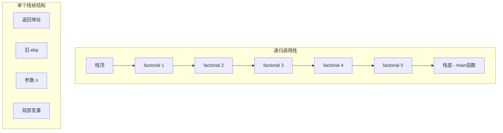
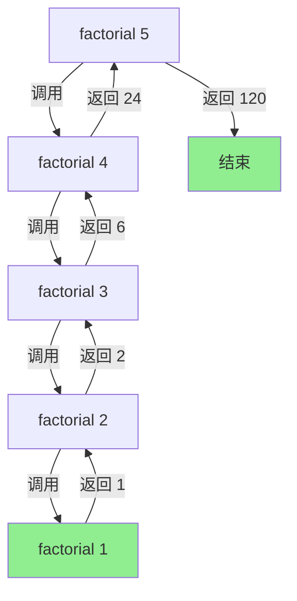
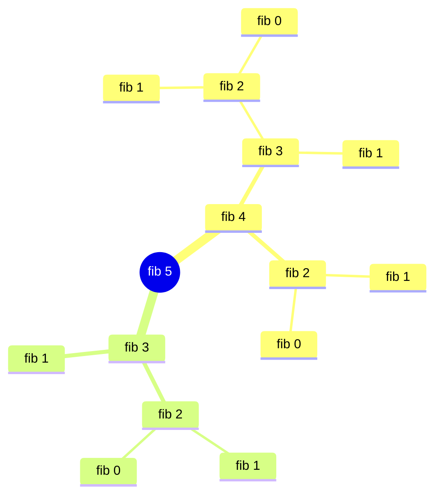
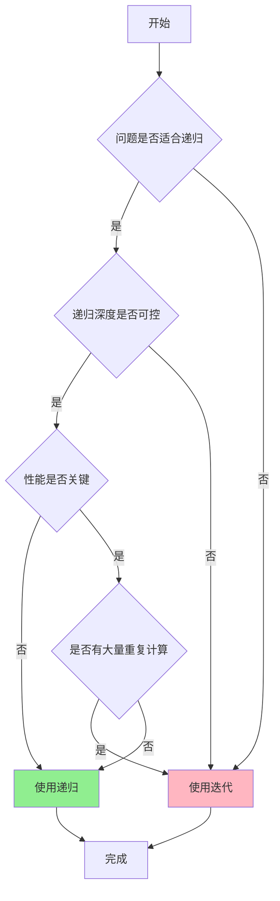

---
title: 汇编语言递归
created: 2026-05-17
updated: 2026-05-17
categories: [汇编语言, 高级主题, 过程与函数]
categoryPath: "汇编语言/高级主题/过程与函数"
tags: [汇编语言, 递归, 栈帧, 算法]
sources: [raw/articles/汇编语言递归.md]
confidence: high
diagramized: true
diagramizedAt: 2026-05-17
---

# 汇编语言递归

递归（Recursion）是函数调用自身的技术。在汇编中实现递归需要正确管理栈帧，每次调用都有独立的参数和局部变量副本。

## 概述

递归是一种强大的编程范式，特别适合解决可以分解为同类子问题的问题。在汇编语言中，递归的实现依赖于对栈的精确管理，确保每次调用都有独立的执行环境。

**为什么重要：**
- 递归能简洁地表达数学归纳类问题
- 是理解函数调用机制的绝佳案例
- 为更复杂的算法（如树遍历、分治算法）奠定基础

## 递归原理与栈帧

### 核心概念

递归的核心在于**每次调用创建新的栈帧**，将当前状态保存在栈上。

每次递归调用都会把参数、返回地址和局部变量压入栈中。当递归终止时，栈帧逐层弹出，每层获得其子调用的结果并完成计算。

### 递归四要素

| 递归要素 | 说明       | 汇编实现                       |
| ---- | -------- | -------------------------- |
| 终止条件 | 防止无限递归   | 条件判断 + je/jg 跳转            |
| 递归调用 | 函数调用自身   | call 指令                    |
| 状态保存 | 每次调用独立状态 | 栈帧（push ebp; mov ebp, esp） |
| 参数传递 | 每次不同参数   | push 参数到栈                  |

### 栈帧结构

一个典型的递归函数栈帧包含：
1. **返回地址** - call 指令自动压入
2. **旧栈帧指针** - push ebp 保存
3. **参数** - 调用者压入
4. **局部变量** - 在栈上分配空间



> 递归虽然代码优雅，但在汇编中每次调用都有不小的栈开销。递归深度过大可能导致栈溢出（Stack Overflow）。对性能敏感的场景，考虑将递归改写为循环。

## 阶乘递归实现

阶乘是递归的经典示例：n! = n × (n-1)!，其中 0! = 1! = 1。

### 完整代码示例

```nasm
; 文件路径：factorial.asm
; 递归计算阶乘：n! = n * (n-1)!

section .data
    n dd 5                  ; 计算 5!
    result dd 0
    output_msg db 'Factorial result: '
    output_len equ $ - output_msg
    newline db 0xA

section .bss
    result_str resb 12

section .text
global _start

_start:
    ; 调用 factorial(5)
    push dword [n]          ; 压入参数 n
    call factorial
    add esp, 4              ; 清理参数
    ; eax = 120 (5!)

    mov [result], eax

    ; 输出结果
    mov eax, 4
    mov ebx, 1
    mov ecx, output_msg
    mov edx, output_len
    int 0x80

    ; 简单输出数字（仅用于个位数演示）
    mov eax, [result]
    ; 这里简化处理
    mov ebx, eax
    mov eax, 1
    int 0x80

; 过程：factorial(n)
; 输入：[ebp+8] = n
; 输出：eax = n!
factorial:
    push ebp                ; 保存旧栈帧
    mov ebp, esp            ; 建立新栈帧

    mov eax, [ebp + 8]      ; 获取参数 n
    cmp eax, 1              ; n <= 1 ?
    jg recurse              ; n > 1，继续递归

    ; 终止条件：n <= 1，返回 1
    mov eax, 1
    jmp factorial_end

recurse:
    ; 保存当前 n 的值（寄存器会被递归调用破坏）
    push eax                ; 保存 n

    ; 递归调用 factorial(n-1)
    dec eax                 ; n - 1
    push eax                ; 参数：n-1
    call factorial          ; 递归调用
    add esp, 4              ; 清理参数

    ; 恢复 n
    pop ebx                 ; ebx = n

    ; eax = n * factorial(n-1)
    mul ebx                 ; edx:eax = eax * ebx
    ; 对于较小的 n，edx 为 0，结果全在 eax 中

factorial_end:
    pop ebp                 ; 恢复旧栈帧
    ret
```

### 执行过程详解

递归计算 factorial(5) 的完整调用栈与返回过程：



```
factorial(5)
  -> 5 * factorial(4)
       -> 4 * factorial(3)
            -> 3 * factorial(2)
                 -> 2 * factorial(1)
                      -> 1  (终止条件)
                 <- 1 * 2 = 2
            <- 2 * 3 = 6
       <- 6 * 4 = 24
  <- 24 * 5 = 120
```

### 关键点说明

1. **栈帧建立**：`push ebp; mov ebp, esp` 是标准序幕
2. **参数访问**：通过 `[ebp+8]` 访问第一个参数
3. **寄存器保护**：在递归调用前保存需要保留的寄存器
4. **结果返回**：使用 eax 寄存器传递返回值

## 斐波那契递归实现

斐波那契数列定义：fib(0) = 0, fib(1) = 1, fib(n) = fib(n-1) + fib(n-2)

### 完整代码示例

```nasm
; 文件路径：fibonacci.asm
; 递归计算斐波那契数列：fib(n) = fib(n-1) + fib(n-2)

section .data
    n dd 10                 ; 计算 fib(10)

section .text
global _start

_start:
    ; 调用 fib(10)
    push dword [n]
    call fibonacci
    add esp, 4
    ; eax = fib(10) = 55

    mov ebx, eax            ; 退出码 = 55
    mov eax, 1
    int 0x80

; 过程：fibonacci(n)
; 输入：[ebp+8] = n
; 输出：eax = fib(n)
fibonacci:
    push ebp
    mov ebp, esp

    mov eax, [ebp + 8]      ; 获取参数 n

    ; 终止条件：n <= 1 返回 n
    cmp eax, 1
    jg fib_recurse          ; n > 1，需要递归
    ; n <= 1：fib(0)=0, fib(1)=1
    jmp fib_end

fib_recurse:
    ; ★ 注意：递归有两个分支，需要仔细管理栈
    push ebx                ; 保存 ebx（将被用于保存中间结果）

    ; 计算 fib(n-1)
    mov eax, [ebp + 8]
    dec eax                 ; n - 1
    push eax
    call fibonacci
    add esp, 4
    mov ebx, eax            ; ebx = fib(n-1)（保存结果！）

    ; 计算 fib(n-2)
    mov eax, [ebp + 8]
    sub eax, 2              ; n - 2
    push eax
    call fibonacci
    add esp, 4
    ; eax = fib(n-2)

    ; eax = fib(n-1) + fib(n-2)
    add eax, ebx            ; eax = fib(n-2) + fib(n-1)

    pop ebx                 ; 恢复 ebx

fib_end:
    pop ebp
    ret
```

### 性能问题



> 递归版本的斐波那契存在大量重复计算。fib(10) 会调用 fib(9)、fib(8)、fib(8) 被两次调用...导致时间复杂度为 O(2ⁿ)。实际工程中建议使用循环迭代版本。

## 斐波那契迭代版本（对比）

### 完整代码示例

```nasm
; 文件路径：fibonacci_iter.asm
; 迭代版本：更高效，无递归开销

section .data
    n dd 10

section .text
global _start

_start:
    mov ecx, [n]            ; ecx = n
    dec ecx                 ; 循环 n-1 次（从第 2 项开始）

    mov eax, 0              ; fib(0) = 0
    mov ebx, 1              ; fib(1) = 1

    cmp ecx, 0
    jle fib_done            ; n <= 1，直接返回

fib_loop:
    mov edx, ebx            ; 保存旧的 fib(n-1)
    add ebx, eax            ; ebx = fib(n-1) + fib(n-2)
    mov eax, edx            ; 更新 fib(n-2)
    loop fib_loop

fib_done:
    ; 对于 n=10，最后 ebx = 55
    mov eax, 1
    mov ebx, ebx            ; 返回值 = fib(n)
    int 0x80
```

## 递归与迭代对比

| 特性   | 递归                 | 迭代          |
| ---- | ------------------ | ----------- |
| 代码量  | 更短，逻辑清晰            | 较长，但性能好     |
| 栈使用  | 每次调用占一个栈帧，深度大时可能溢出 | 固定少量空间      |
| 性能   | 有 call/ret 开销      | 无函数调用开销     |
| 可读性  | 对数学归纳类问题直观         | 需要手动维护循环状态  |
| 适用场景 | 树遍历、分治算法、数学归纳      | 简单重复、性能敏感场景 |

## 实际应用建议

汇编中每次递归调用都会消耗栈空间。Linux 默认栈大小约 8MB，对于深度为 100000 的递归可能就会栈溢出。



**何时使用递归：**
- 问题的递归深度可控（如平衡树深度 O(log n)）
- 递归逻辑比迭代清晰很多
- 代码可读性优先于极致性能

**何时避免递归：**
- 递归深度不可预测
- 性能是关键考量
- 存在大量重复计算（如斐波那契）

## 相关概念

- [[汇编语言过程]] - 理解函数调用的基础
- [栈介绍](../安全/CTF/pwn/栈溢出基础/栈介绍.md) - 栈的工作原理
- [C语言函数调用栈（一）](../安全/CTF/pwn/栈溢出基础/C语言函数调用栈（一）.md) - 高级语言中的栈帧

## 参考资料

- 来源：https://www.runoob.com/assembly/assembly-recursion.html
