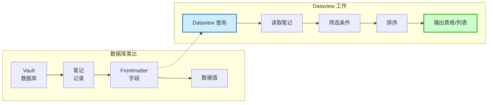
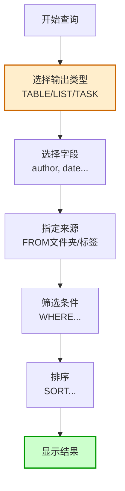
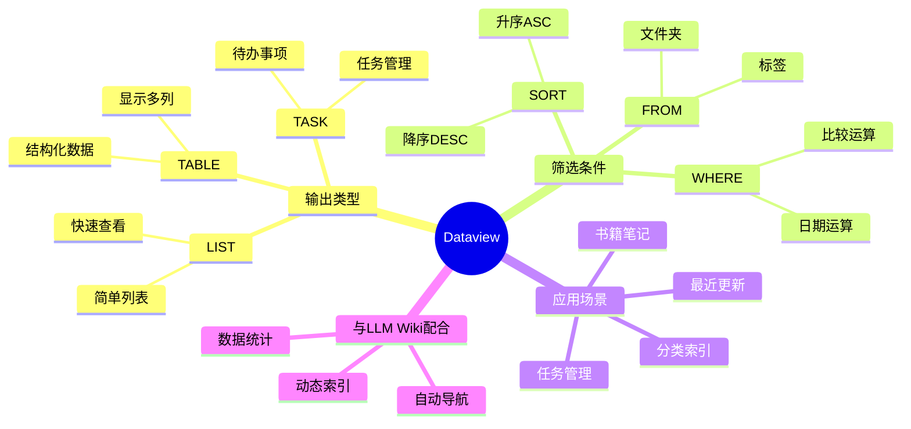

# Dataview

## 概述

Dataview 是一个强大的 [[笔记与知识管理/笔记工具/Obsidian]] 插件，它让你可以像查询数据库一样查询你的笔记！在 [[LLM Wiki 生态/LLM Wiki 基础/LLM Wiki]] 模式中，Dataview 非常重要，因为它可以让你的 Wiki 内容动态呈现！

简单来说：**Dataview = 给你的 Wiki 加上 SQL 查询能力！**

## 什么是 Dataview？

Dataview 是 Obsidian 的一个插件，它使用 Markdown 页面的 YAML frontmatter 和内容来进行查询和筛选。

### 核心概念

| 概念 | 说明 |
|------|------|
| **Frontmatter** | 页面开头的 YAML 元数据 |
| **查询** | 用简单语法查询笔记 |
| **动态视图** | 自动更新的表格和列表 |
| **实时** | 数据变化时自动更新 |

### 形象比喻

想象一下：
- 你的 Obsidian Vault = 一个数据库
- 每个笔记 = 一条数据库记录
- Frontmatter = 字段
- **Dataview = SQL 查询引擎！**

### Dataview 核心概念图



## 为什么用 Dataview？

### 1. 让数据活起来

有了 Dataview，你可以：
- 自动列出所有书籍笔记
- 显示最近一个月的笔记
- 统计各种数据
- 创建动态索引页面

### 2. 与 LLM Wiki 完美配合

在 LLM Wiki 模式中：
- LLM 自动给页面加上 frontmatter（标签、日期、来源等）
- Dataview 可以基于这些元数据生成动态表格
- 让你的 Wiki 不仅是静态页面，还能有动态视图！

### 3. 不需要编程

Dataview 的语法非常简单，不需要会编程也能使用！

## 基本语法

### 1. Frontmatter

首先，你需要在笔记的 frontmatter 中添加数据：

```yaml
---
title: 我的笔记
author: 小明
date: 2026-05-14
tags: [学习, 笔记]
rating: 5
---
```

### 2. 简单查询

然后，你可以这样查询：

```dataview
TABLE author, date, rating
FROM "学习笔记"
WHERE rating > 3
SORT date DESC
```

这个查询会：
- 列出「学习笔记」文件夹下的笔记
- 显示作者、日期、评分
- 筛选评分大于 3 的
- 按日期降序排列

### Dataview 查询语法流程图



## 常用查询示例

### 1. 列出所有书籍笔记

```dataview
TABLE author, year, rating
FROM "书籍笔记"
SORT rating DESC
```

### 2. 显示最近一周的笔记

```dataview
LIST 
WHERE date >= date(today) - dur(7 days)
SORT date DESC
```

### 3. 按标签分类

```dataview
TABLE date
FROM #概念
SORT date
```

### 4. 任务列表

```dataview
TASK 
WHERE !completed
```

### Dataview 常用查询思维导图



## 在 LLM Wiki 中的应用

在 [[LLM Wiki 生态/LLM Wiki 基础/LLM Wiki]] 模式中，Dataview 可以做很多事！

### 1. 自动索引

LLM 可以生成这样的页面：
- 所有概念页面列表
- 最近更新的内容
- 按分类汇总的笔记
- 待阅读/待处理的内容

### 2. 动态导航

你可以创建这样的查询：
- 这个概念相关的所有页面
- 同一个作者的内容
- 相关时间的内容

### 3. 数据仪表盘

甚至可以做简单的数据统计：
- 本月新增多少笔记
- 各种标签的使用情况
- 阅读进度统计

## 工作流示例

### 传统方式（无 Dataview）

1. 你手动创建索引
2. 每次加新笔记都要手动更新索引
3. 容易忘记和出错

### 有了 Dataview 后

1. LLM 自动给新笔记加上 frontmatter
2. 你写一个 Dataview 查询
3. **索引自动更新！**

### LLM Wiki 与 Dataview 工作流

```mermaid
graph TB
    subgraph 传统方式
        A[写新笔记] --> B[手动更新索引]
        B --> C[容易遗忘/出错]
    end
    
    subgraph LLM Wiki + Dataview
        D[LLM 处理内容] --> E[自动添加Frontmatter]
        E --> F[写 Dataview 查询]
        F --> G[索引自动更新!]
    end
    
    subgraph 完整流程
        H[用户提供内容] --> I[LLM 生成 Wiki 页面]
        I --> J[添加元数据]
        J --> K[Dataview 查询]
        K --> L[动态视图]
    end
    
    style E fill:#CCEEFF,stroke:#0066CC,stroke-width:2px
    style G fill:#CCFFCC,stroke:#009900,stroke-width:2px
```



## 常见问题

### Q1：我需要懂编程才能用 Dataview 吗？

不需要！基本的查询语法非常简单，像是在写自然语言！

### Q2：Dataview 会修改我的笔记吗？

不会！它只读取笔记，不会修改你的任何内容。

### Q3：Dataview 查询保存在哪里？

直接写在 Markdown 笔记中，和你的内容在一起！

### Q4：在 LLM Wiki 中如何配合使用？

- LLM 负责给笔记加 frontmatter
- 你写好 Dataview 查询
- **自动化！**

## 相关概念

- [[笔记与知识管理/笔记工具/Obsidian]] - 笔记工具
- [[LLM Wiki 生态/LLM Wiki 基础/LLM Wiki]] - LLM Wiki 模式
- [[LLM Wiki 生态/LLM Wiki 基础/LLM Wiki 三层架构]] - 三层架构

## 总结

Dataview 是 Obsidian 的超级插件，它让你的笔记变成可查询的数据库！在 LLM Wiki 模式中，结合 LLM 自动生成的 frontmatter，Dataview 可以让你的 Wiki 拥有强大的动态功能！

**试试 Dataview，让你的 Wiki 动起来！**
