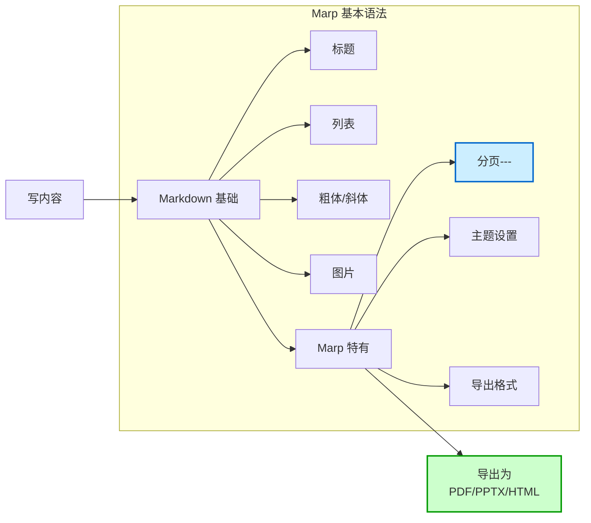
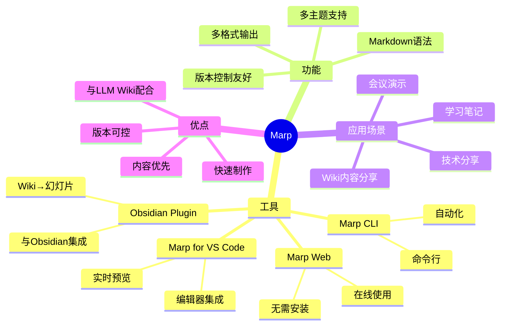
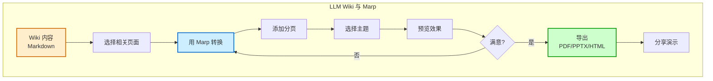
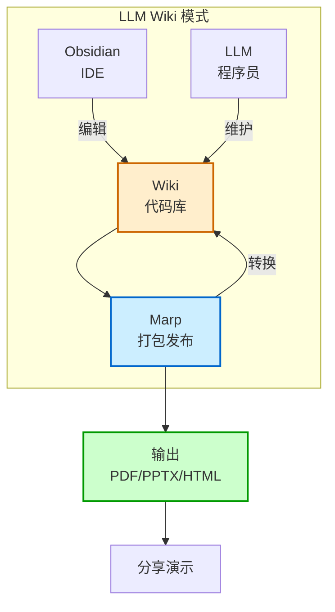

# Marp

## 概述

Marp 是一个基于 Markdown 的幻灯片制作工具和格式，它让你可以用纯 Markdown 语法快速制作美观的演示文稿。Marp 在 [[LLM Wiki 生态/LLM Wiki 基础/LLM Wiki]] 模式中也被提及，作为将 Wiki 内容转化为演示文稿的方法！

简单来说：**Marp = Markdown + 幻灯片！**

## 什么是 Marp？

Marp 是一个开源的幻灯片制作系统，它的核心特点是使用纯 Markdown 来编写幻灯片。

### 核心特点

| 特点 | 说明 |
|------|------|
| **Markdown 语法** | 用熟悉的 Markdown 写幻灯片 |
| **多种输出格式** | 支持 HTML、PDF、PPTX 等 |
| **主题支持** | 多种美观的主题可选 |
| **简单快速** | 专注内容，无需调整格式 |

### 经典比喻

想象一下：
- PowerPoint = 用 Word 做幻灯片（需要花很多时间调格式）
- Marp = 用 Markdown 做幻灯片（专注内容，自动帮你排版！）

## 为什么用 Marp？

### 1. 内容优先

用 Marp，你可以：
- 只关注你想讲什么内容
- 不用花时间调整字体、位置、格式
- 内容写完，幻灯片就做好了！

### 2. 版本控制友好

因为是纯 Markdown 文件：
- 可以用 Git 管理版本
- 可以对比历史修改
- 可以协作编辑

### 3. 与 LLM Wiki 完美配合

在 LLM Wiki 模式中：
- Wiki 内容是 Markdown
- 可以直接把 Wiki 内容变成 Marp 幻灯片
- 演示文稿和知识库无缝连接！

## 基本语法

Marp 的语法非常简单，就是 Markdown 加上几个简单的规则！

### 分页

用 `---` 或者 `***` 来分页：

```markdown
# 第一页

这里是第一页的内容

---

# 第二页

这里是第二页的内容
```

### 常见语法

- `# 标题` - 大标题
- `## 副标题` - 小标题
- `- 列表项` - 无序列表
- `1. 列表项` - 有序列表
- `**粗体**` - 加粗文字
- `*斜体*` - 斜体文字
- `` - 插入图片

### Marp 语法流程图



## Marp 生态系统

Marp 有多个工具和插件，满足不同场景：

| 工具 | 说明 |
|------|------|
| **Marp for VS Code** | VS Code 插件，直接在编辑器中写 |
| **Marp Web** | 网页版，在线使用 |
| **Marp CLI** | 命令行工具，适合自动化 |
| **Obsidian Marp Plugin** | Obsidian 插件！ |

### Marp 生态系统思维导图



## Obsidian 集成

Marp 和 [[笔记与知识管理/笔记工具/Obsidian]] 完美配合！

### 可以做什么

- 直接在 Obsidian 中写 Marp 幻灯片
- 实时预览效果
- 导出为 PDF、PPTX、HTML
- 用 Wiki 中的内容快速制作演示文稿

### 工作流示例

1. 在 Wiki 中写好内容
2. 用 Marp 把相关内容变成幻灯片
3. 导出为需要的格式
4. 展示你的演示文稿！

### Marp 工作流程图



## 应用场景

Marp 适合用在这些地方：

| 场景 | 为什么适合 |
|------|-----------|
| **技术分享** | 程序员熟悉 Markdown，快速制作 |
| **学习笔记** | 把笔记变成幻灯片方便复习 |
| **会议演示** | 快速制作简洁的演示文稿 |
| **Wiki 内容分享** | 把 Wiki 中的内容变成演示文稿 |

## 与 LLM Wiki 的关系

在 [[LLM Wiki 生态/LLM Wiki 基础/LLM Wiki]] 模式中：
- Obsidian 是 IDE
- LLM 是程序员
- Wiki 是代码库
- **Marp 是打包和发布工具！**

你可以把 Wiki 中的知识用 Marp 快速变成演示文稿分享给别人！

### LLM Wiki 与 Marp 关系图



## 常见问题

### Q1：Mar 和 PowerPoint/Keynote 有什么区别？

- PowerPoint：所见即所得，视觉调整多
- Marp：内容优先，Markdown 驱动，适合快速制作

### Q2：我可以在 Marp 中插入代码吗？

当然可以！Marp 支持 Markdown 的代码块语法！

### Q3：Marp 的主题可以自定义吗？

可以！可以自定义 CSS 来调整样式！

## 相关概念

- [[笔记与知识管理/笔记工具/Obsidian]] - 常用的笔记工具
- [[LLM Wiki 生态/LLM Wiki 基础/LLM Wiki]] - LLM Wiki 模式
- [[LLM Wiki 生态/LLM Wiki 基础/LLM Wiki 三层架构]] - 三层架构

## 总结

Marp 是一个强大又简单的工具，让你用 Markdown 就能制作美观的幻灯片。它和 Obsidian 完美配合，在 LLM Wiki 模式中更是如虎添翼！

**试试 Marp，让你的 Wiki 内容活起来！**
