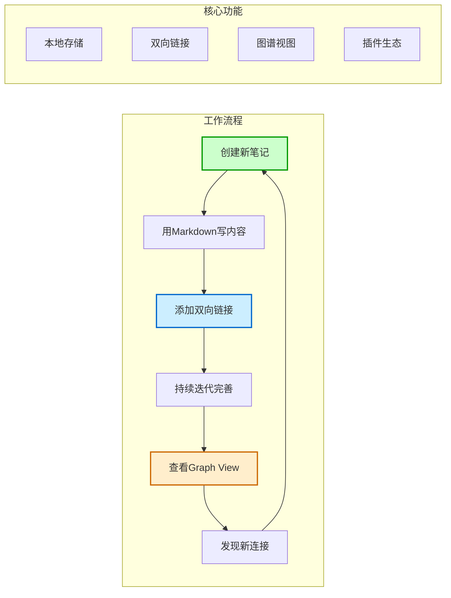
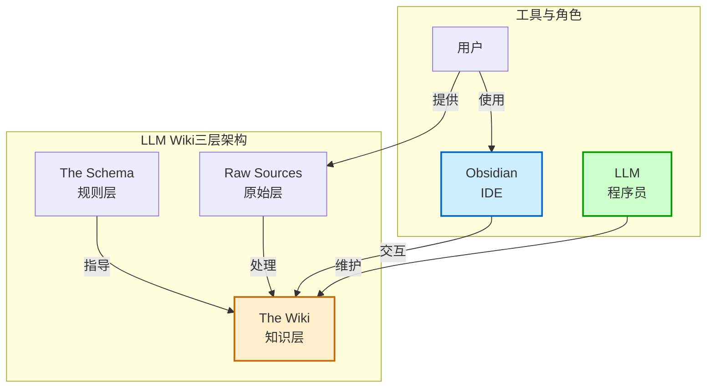
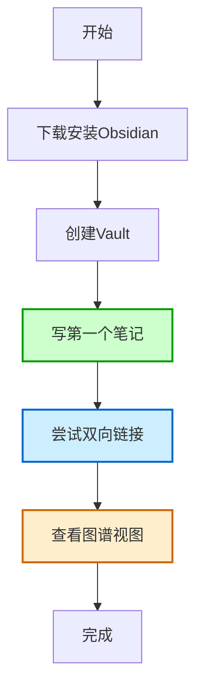
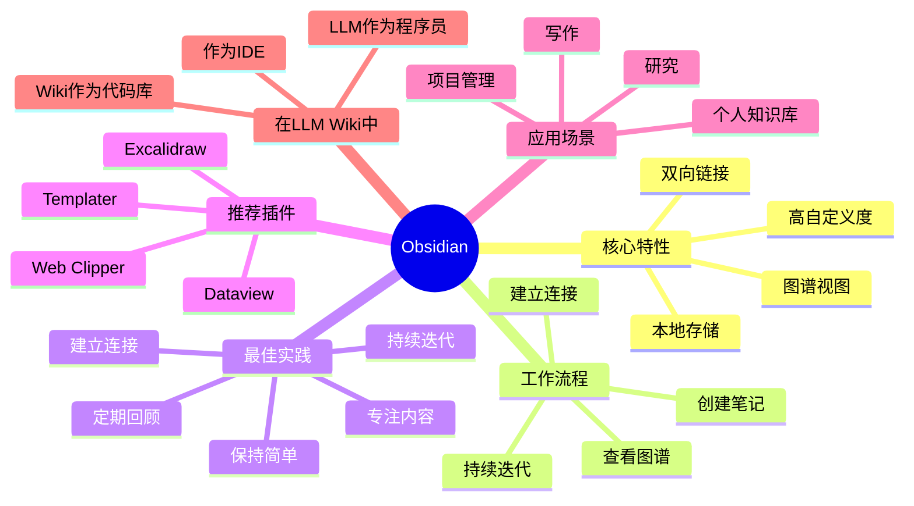

# Obsidian

## 概述

Obsidian 是一款基于本地 Markdown 文件的笔记软件。它就像一个「数字花园」，让你的知识可以自由生长、连接和演化。

在 LLM Wiki 模式中，Obsidian 被用作 IDE（集成开发环境），是构建个人知识库的核心工具。

## 什么是 Obsidian？

Obsidian 是一款 2020 年发布的笔记应用，由 Shida Li 和 Erica Xu 创立。它的核心理念是「你的数据永远属于你自己」。

与其他云笔记软件不同，Obsidian 将所有笔记以纯 Markdown 格式存储在你的本地硬盘上。这意味着你永远不会被某个平台锁定，你的数据永远是安全的。

可以把 Obsidian 想象成一个「知识的文件夹管理器」，但它比普通的文件管理器强大得多。

## 核心特性

Obsidian 的强大之处在于以下几个关键特性：

### 1. 本地存储
- 所有笔记都是纯 Markdown 文件
- 直接存储在你的硬盘上
- 不联网也能完全使用
- 数据永远属于你自己

这就像把钱存在家里的保险柜里，而不是存在银行里——你永远拥有完全的控制权。

### 2. 双向链接
- 可以引用笔记库中任何其他笔记
- 被引用的笔记会显示反向链接
- 轻松建立知识之间的连接
- 支持 [[Page Name]] 格式的双链

这就像维基百科的内部链接，但更加强大和灵活。

### 3. Graph View（图谱视图）
- 可视化展示笔记之间的连接
- 每个笔记是一个节点
- 每个链接是一条边
- 可以看到知识网络的全局视图

想象一下你的笔记像星座一样在夜空中连接起来，这就是 Graph View 的效果。

### 4. 高自定义度
- 丰富的插件生态系统
- 强大的主题定制功能
- 灵活的工作区布局
- 支持各种工作流

Obsidian 就像一个乐高积木，你可以按照自己的方式来搭建。

## 什么是重要的，什么是不重要的？

在使用 Obsidian 时，需要分清主次：

### ✅ 重要的
| 功能 | 为什么重要 |
|------|-----------|
| 双链功能 | 这是知识连接的核心 |
| 本地存储 | 保证数据安全和可控 |
| 核心笔记方法 | 内容比工具更重要 |

### ❌ 不重要的
| 功能 | 为什么不重要 |
|------|-----------|
| 插件 | 不用插件也能很好地使用 |
| 美化 | 好看不代表好用 |
| 复杂配置 | 简单就是美 |

记住：工具只是手段，知识才是目的。不要陷入「工具收集癖」的陷阱。

## 核心工作流程

使用 Obsidian 的基本工作流程很简单：

1. **创建笔记** - 用 Markdown 格式写下想法
2. **建立连接** - 用 [[双链]] 连接相关笔记
3. **持续迭代** - 不断修改和完善笔记
4. **查看图谱** - 用 Graph View 发现意外连接

这就像种植一座花园，你需要不断浇水、修剪、移植，最后让它自然生长成美丽的样子。

### Obsidian 工作流程图

## 推荐插件（可选）

虽然插件不是必需的，但以下几个插件可以提升效率：

| 插件 | 用途 |
|------|------|
| **Obsidian Web Clipper** | 将网页转换为 Markdown 保存 |
| **Dataview** | 基于页面 frontmatter 的动态查询 |
| **Templater** | 强大的模板系统 |
| **Excalidraw** | 手绘风格的图表工具 |

插件建议：只在真正需要时才安装，保持简洁。

## 在 LLM Wiki 中的角色

在 LLM Wiki 模式中，三者的关系是：

- **Obsidian** = IDE（集成开发环境）- 你用来查看和编辑知识的工具
- **LLM** = 程序员 - 负责处理和组织知识
- **Wiki** = 代码库 - 存储结构化知识的地方

这个比喻来自 [[笔记与知识管理/重要人物/Andrej Karpathy]]，很好地说明了三者如何协同工作。

### LLM Wiki 三层架构与 Obsidian

## 应用场景

Obsidian 适用于各种场景：

### 1. 个人知识库
- 整理学习笔记
- 记录重要想法
- 建立知识体系

### 2. 项目管理
- 跟踪项目进度
- 记录会议纪要
- 整理相关资料

### 3. 写作
- 大纲规划
- 素材收集
- 文章撰写

### 4. 研究
- 文献整理
- 思路记录
- 发现关联

## 快速入门指南

如果你是第一次使用 Obsidian，可以按照以下步骤开始：

### 第 1 步：安装
- 下载并安装 Obsidian
- 选择一个空文件夹作为 vault（仓库）

### 第 2 步：创建第一个笔记
- 点击「新建笔记」
- 输入文件名和内容
- 保存

### 第 3 步：尝试双链
- 在笔记中输入 [[
- 选择要链接的笔记
- 点击链接查看反向链接

### 第 4 步：查看图谱
- 点击左侧的 Graph View 图标
- 看看你的笔记是如何连接的

就这么简单！不需要任何复杂的配置，就能开始使用了。

### 快速入门流程图

## 常见问题

### Q1：我需要学习 Markdown 吗？
A：是的，但 Markdown 非常简单，只需要 10 分钟就能掌握基本语法。而且 Obsidian 有可视化编辑器，即使不懂 Markdown 也能用。

### Q2：我需要安装很多插件吗？
A：不需要。Obsidian 的核心功能已经非常强大，插件只是锦上添花。建议先使用基础功能，等真正需要时再安装插件。

### Q3：数据安全吗？
A：非常安全！因为所有数据都在你的本地硬盘上。你可以用 Git、Dropbox、iCloud 等工具进行备份。

### Q4：Obsidian 免费吗？
A：个人使用完全免费。如果需要付费功能（如同步、发布），可以根据需要选择。

## 最佳实践

以下是一些使用 Obsidian 的建议：

1. **保持简单** - 不要过度复杂化你的工作流
2. **专注内容** - 笔记的内容比格式更重要
3. **持续迭代** - 笔记不需要一次就完美
4. **建立连接** - 多使用双链，让知识网络化
5. **定期回顾** - 经常查看 Graph View，发现新关联

### Obsidian 最佳实践思维导图

## 相关概念

- [[LLM Wiki 生态/LLM Wiki 基础/LLM Wiki]] - LLM Wiki 模式介绍
- [[笔记与知识管理/笔记方法/Zettelkasten]] - 卡片盒笔记法
- [[笔记与知识管理/笔记方法/原子笔记]] - 每个笔记只包含一个知识点
- [[笔记与知识管理/笔记方法/MOC]] - 内容地图，知识导航页面
- [[笔记与知识管理/笔记方法/盖尔定律]] - 从简单系统开始演化
- [[资料存档/原始视频/喂饭教程-Obsidian新手教程]] - 详细的视频教程
- [[笔记与知识管理/笔记工具/Marp]] - 基于 Markdown 的幻灯片格式
- [[笔记与知识管理/笔记工具/Dataview]] - 动态查询插件

## 参考资料

- [Obsidian 官方网站](https://obsidian.md/)
- [Obsidian 中文社区](https://forum-zh.obsidian.md/)
- [[资料存档/原始视频/喂饭教程-Obsidian新手教程]]
- [[资料存档/原始文章/llm-wiki-by-karpathy]]
