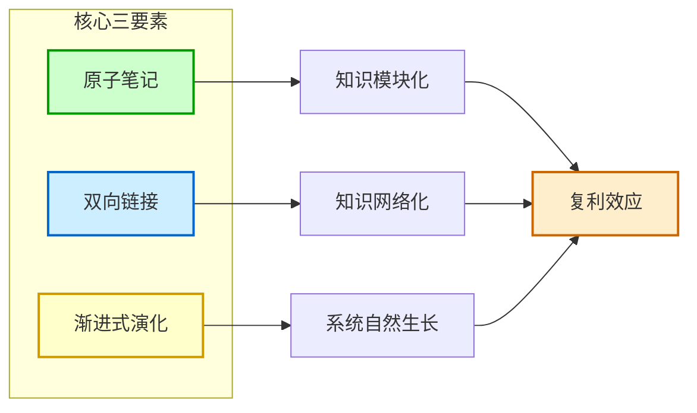
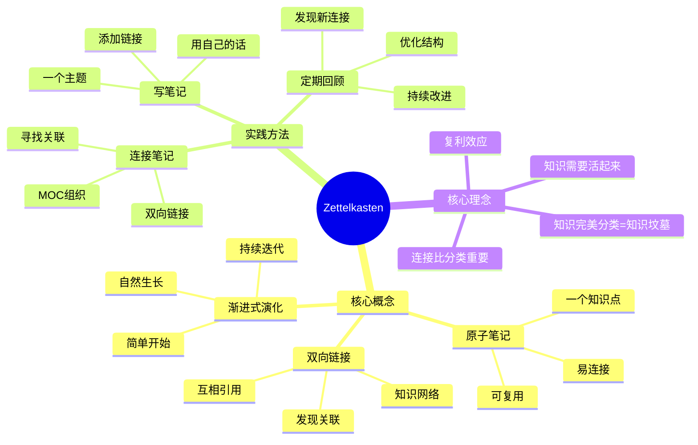

# Zettelkasten（卡片盒笔记法）

## 概述

Zettelkasten（德语，意为"卡片盒"）是一种强大的笔记方法，通过将知识拆分成独立的卡片（笔记），并建立卡片之间的链接，模拟大脑神经元的连接方式。

它就像一个「思想网络」，让你的知识互相连接，产生新想法。

## 什么是 Zettelkasten？

Zettelkasten 是一种由德国社会学家 Niklas Luhmann（尼克拉斯·卢曼）发明和使用的笔记方法。

卢曼用这个方法写了 70 多本书，数百篇论文！

### 一个简单的类比

想象一下你的大脑：
- 神经元互相连接
- 一个想法会触发另一个想法
- 连接越多，越聪明

Zettelkasten 就是让你的笔记也像神经元一样连接起来！

## 核心要素

Zettelkasten 有三个核心要素：

| 要素 | 说明 | 为什么重要 |
|------|------|-----------|
| **原子笔记** | 每个笔记只包含一个知识点 | 方便连接和复用 |
| **双向链接** | 笔记之间互相引用 | 模拟大脑的连接方式 |
| **渐进式演化** | 从简单系统开始，逐步完善 | 不用追求完美，开始最重要 |

### Zettelkasten 核心要素图解



### Zettelkasten 知识网络思维导图



### 1. 原子笔记

「原子」意味着「不可再分」。

一个笔记只说一件事！

#### 为什么要原子？

- **容易连接** - 一个想法能和多个其他想法连接
- **容易找到** - 搜索时不会被无关内容干扰
- **容易理解** - 简单明了
- **容易复用** - 需要时可以直接拿出来用

#### 正例 vs 反例

**不好的例子**：
```
# 人工智能
这篇笔记讲了什么是 AI，AI 的历史，AI 的应用，AI 的未来...
```
（笔记太长了，什么都讲，不专注）

**好的例子**：
```
# 人工智能的定义
人工智能是...

# 人工智能的起源
AI 一词最早是在 1956 年...

# 人工智能的应用
AI 可以用于...
```
（每个笔记只讲一个点，清晰明了）

### 2. 双向链接

链接让笔记活起来！

#### 什么是双向链接？

- **传统链接**：从 A 到 B，单向的
- **双向链接**：从 A 到 B，也从 B 到 A

就像网页的超链接，但更强大！

#### 链接的魔力

当你把笔记连接起来：
- 你会发现意外的关联
- 新想法会自动出现
- 知识会变得立体化

就像一张地图，原来孤立的地点现在都连起来了！

### 3. 渐进式演化

不要追求完美！

#### 什么是渐进式演化？

- **第一天**：只写一点笔记
- **第一周**：加几个链接
- **第一个月**：慢慢丰富
- **一年后**：一个强大的知识网络

就像种树，从一棵小树苗开始，慢慢长成大树！

## 核心理念

Zettelkasten 有个非常著名的观点：

> "知识完美分类等于给知识造一个完美的坟墓"

### 这句话是什么意思？

传统的笔记方法：
- 把笔记放到文件夹里
- 分类整齐
- 看起来很有条理
- 但是...笔记都是孤立的！

就像书都放在书架上，但它们之间没有连接。

### Zettelkasten 的理念

应该关注：
- ✅ **知识之间的连接**
- ❌ **不是分类和收集**

知识要「活」起来，互相连接，而不是被关在文件夹里！

## 为什么 Zettelkasten 有效？

### 1. 让想法碰撞

当笔记连接起来，不同领域的知识会碰撞，产生新想法！

比如：
- 心理学笔记 + 经济学笔记 → 行为经济学
- 生物学笔记 + 计算机笔记 → 人工智能

### 2. 减轻记忆负担

不用记所有东西，只需要记住怎么找到它！

笔记会替你记住细节。

### 3. 长期复利

今天花 10 分钟写笔记，1 年后给你带来 1000 个新想法！

就像存钱，复利效应！

## 如何开始？

### 第一步：不用想太多

不要担心：
- 我的分类对不对？
- 这个笔记写得好不好？
- 我是不是应该先学更多？

**直接开始写！**

### 第二步：一个笔记只讲一件事

就这么简单！

### 第三步：看到连接就加链

当你觉得这个笔记和那个笔记有关，加个链接！

### 第四步：持续添加

每天写一点，慢慢你的知识网络就会越来越大！

## 常见问题

### Q1：我需要用特定工具吗？
A：卢曼是用纸卡片做的！你可以用纸、用 Obsidian、用 Notion...都可以。工具不重要，理念才重要。

### Q2：我需要先学很多知识吗？
A：不用！从写第一个笔记开始。边做边学。

### Q3：记了一堆笔记，但是找不到怎么办？
A：搜索 + 链接！用搜索找笔记，用链接发现更多笔记。

### Q4：这个方法太难了，我做不到怎么办？
A：从简单开始！先写 3 个笔记，互相链接一下。慢慢就习惯了。

## 最佳实践

### 1. 保持简单
- 不要过度设计
- 不要搞复杂的分类
- 就是写笔记、加链接

### 2. 定期回顾
- 看看你的笔记网络
- 发现新的连接
- 加一些你之前没看到的链接

### 3. 不怕修改
- 笔记可以改
- 链接可以调整
- 错了也没关系

### 4. 享受过程
- 看着你的知识网络成长
- 发现新想法很有趣
- 这就是乐趣所在！

## Zettelkasten 与 LLM Wiki

LLM Wiki 的理念和 Zettelkasten 是一致的！

- 都是关于知识连接
- 都是让知识「活」起来
- 都有复利效应

可以说：LLM Wiki 就是 AI 时代的 Zettelkasten！

## 相关概念

- [[笔记与知识管理/笔记方法/原子笔记]] - Zettelkasten 的基础
- [[笔记与知识管理/笔记方法/MOC]] - 内容地图，知识导航
- [[笔记与知识管理/笔记工具/Obsidian]] - 常用工具
- [[笔记与知识管理/笔记方法/盖尔定律]] - 为什么从简单开始
- [[笔记与知识管理/笔记方法/Embrace Chaos]] - 接受不完美

## 参考资料

- [[资料存档/原始视频/喂饭教程-Obsidian新手教程]]
- 《How to Take Smart Notes》（关于 Zettelkasten 的经典书籍）
