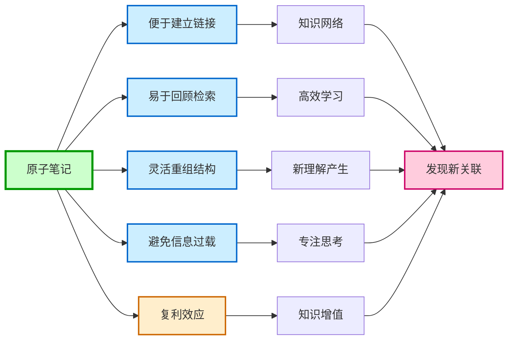
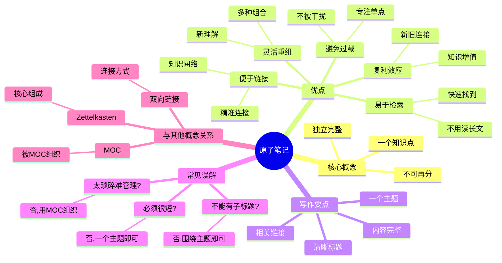

# 原子笔记

## 概述

原子笔记是 [[笔记与知识管理/笔记方法/Zettelkasten]] 方法的核心概念之一！每个笔记只包含一个独立的知识点，就像原子一样不可再分！

**简单来说：原子笔记 = 一个笔记只讲一件事！**

## 什么是原子笔记？

原子笔记的定义很简单：**每个笔记只包含一个独立的知识点**！

### 为什么叫"原子"？

- **原子** = 物质的最小单位，不可再分
- **原子笔记** = 知识的最小单位，只讲一个点
- 就像化学中的原子，是构成更大结构的基础！

### 经典比喻

想象一下：
- 传统笔记 = 一篇长文章，什么都有
- 原子笔记 = 一张张卡片，每张一个知识点
- **像乐高积木，可以自由组合！**

## 原子笔记的优点

为什么要用原子笔记？好处太多了！

| 优点 | 详细说明 |
|------|----------|
| **便于建立精细的知识链接** | 每个知识点都能精准链接到其他相关笔记 |
| **易于回顾和检索** | 找具体内容时，不用读一大篇文章 |
| **灵活重组知识结构** | 可以按不同方式重新组合，产生新的理解 |
| **避免信息过载** | 每次只关注一个点，不被其他信息干扰 |
| **复利效应** | 新笔记可以和旧笔记连接，知识越来越有价值 |

### 原子笔记优点图解

### 原子笔记思维导图

## 具体示例

让我们看一些实际例子！

### 学习线性代数时

不要把所有内容写在一个笔记里：
- ❌ 坏例子："线性代数笔记.md"（几百页，什么都有）
- ✅ 好例子：
  - "向量定义.md"
  - "矩阵乘法.md"
  - "行列式计算.md"
  - "特征值与特征向量.md"

### 学习编程时

- ❌ 坏例子："Python教程.md"
- ✅ 好例子：
  - "Python列表推导式.md"
  - "Python装饰器.md"
  - "Python上下文管理器.md"

## 如何写好原子笔记

写原子笔记其实很简单，记住这几点！

### 1. 一个笔记，一个主题

- 问自己：这个笔记讲了几件事？
- 如果超过一件，就拆分成多个！

### 2. 取一个清晰的标题

- 标题要能概括这个笔记的内容
- 别人看标题就知道讲的是什么
- 方便链接时理解

### 3. 内容要完整

虽然是"原子"，但内容要完整：
- 定义清晰
- 有必要的说明
- 有例子更好
- 能独立理解

### 4. 链接到相关笔记

- 提到其他概念时，加上双向链接
- 让知识形成网络
- 这就是复利的关键！

## 原子笔记的常见误解

### 误解 1：原子笔记必须很短

不一定！有些复杂概念可能需要比较长的解释，但只要只讲一个主题，就是好的原子笔记！

### 误解 2：原子笔记不能有子标题

当然可以有子标题！只要这些子标题都是围绕同一个主题的！

### 误解 3：原子笔记太琐碎，不好管理

不会的！因为有 [[笔记与知识管理/笔记方法/MOC]]（内容地图）来组织它们！

## 原子笔记与其他概念的关系

| 概念 | 关系 |
|------|------|
| **[[笔记与知识管理/笔记方法/Zettelkasten]]** | 原子笔记是 Zettelkasten 的核心 |
| **[[笔记与知识管理/笔记方法/MOC]]** | MOC 组织多个原子笔记 |
| **[[笔记与知识管理/笔记方法/Embrace Chaos]]** | 不用太担心分类，用链接就好 |
| **双向链接** | 原子笔记之间的连接方式 |

## 实践建议

刚开始可能不习惯，试试这些方法：

1. **从现有笔记拆分**：把你的长笔记拆成原子笔记
2. **每天写几个**：不用一下全改，逐步来
3. **定期回顾**：看看哪些笔记还可以再拆分
4. **不用追求完美**：刚开始不完美也没关系，迭代改进

## 总结

原子笔记是一种强大的知识管理方式！它让知识模块化、可复用、能复利！虽然刚开始可能有点不习惯，但坚持下去，你会发现知识网络的威力！

**试试原子笔记，感受知识复利的魔力！**
