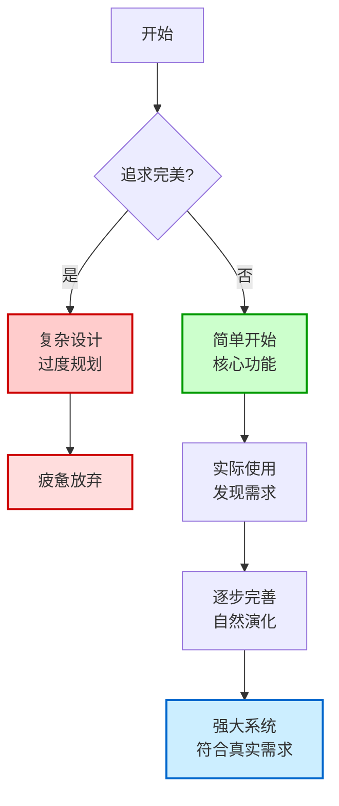
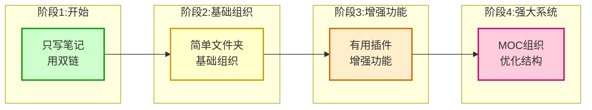
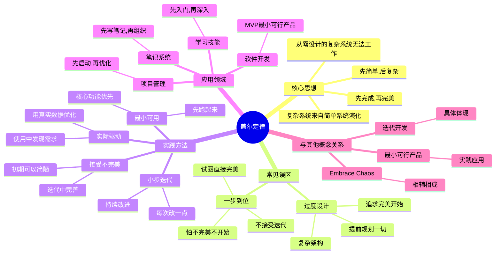

# 盖尔定律

## 概述

盖尔定律（Gall's Law）是系统设计中的一条重要定律！它告诉我们：复杂系统一定是从简单系统演化来的，而不是一开始就设计得很复杂！

**简单来说：盖尔定律 = 先简单，再复杂，不要试图一步到位！**

## 什么是盖尔定律？

盖尔定律的原文是这样的：

> "一个复杂而有效的系统总是从一个简单而有效的系统演化而来的。从零开始设计的复杂系统永远无法运行，也无法修修补补使其运行。你必须从一个简单的有效系统重新开始。"

让我们用大白话翻译一下：
- 你没法从零直接做出一个完美的复杂系统
- 你得先做出一个简单但能用的系统
- 然后让它慢慢演化，变得复杂且强大

### 经典比喻

想象一下：
- ❌ 试图一步到位 = 直接盖摩天大楼，但地基还没打好
- ✅ 盖尔定律 = 先盖个小房子，能住人，然后慢慢加盖，最后变成摩天大楼！

## 为什么盖尔定律重要？

因为我们总是忍不住想一开始就做得很完美！

### 常见误区

很多人会犯这些错误：

| 误区 | 结果 |
|------|------|
| 一开始就搭建完美的笔记系统 | 花几个月设计，还没开始用就放弃了 |
| 试图写一篇完美的笔记 | 迟迟不敢下笔，最后什么都没写 |
| 想一次性把所有知识整理好 | 工作量太大，半途而废 |

### 盖尔定律告诉我们

- 完美是好的敌人
- 先完成，再完美
- 迭代改进，而不是一步到位

## 在笔记系统中的应用

盖尔定律在笔记系统中特别有用！

### 不要一开始就搭建复杂的笔记系统

很多人刚开始用笔记软件时：
- 下载 20 个插件
- 设计完美的文件夹结构
- 制作精美的模板
- 结果：还没开始写笔记就累了，放弃了

### 从简单的核心功能开始

建议这样开始：

| 阶段 | 做什么 | 为什么 |
|------|--------|--------|
| **阶段 1** | 只写笔记，用双链 | 核心功能，先跑起来 |
| **阶段 2** | 加入简单的文件夹 | 基本的组织 |
| **阶段 3** | 尝试一些有用的插件 | 增强功能 |
| **阶段 4** | 建立 MOC，优化结构 | 让系统更强大 |

### 笔记系统演化流程图

### 笔记系统发展阶段图解

### 随着使用逐步完善和扩展

- 用着用着，你就知道缺什么
- 让系统自然演化
- 不要提前优化！

### 让系统自然演化

不要试图预测未来所有需求！
- 你现在想的，可能以后根本不用
- 你现在没想到的，以后可能很需要
- 让使用告诉你系统应该怎么发展

## 盖尔定律的更多应用场景

盖尔定律不止适用于笔记系统！

### 软件开发

- ❌ 坏例子：一开始就设计完美的架构
- ✅ 好例子：先做最小可行产品（MVP），再迭代

### 学习新技能

- ❌ 坏例子：想一次性学完所有东西
- ✅ 好例子：先学基础，能用上，再深入

### 项目管理

- ❌ 坏例子：一开始就写完美的计划
- ✅ 好例子：先做能跑的版本，再持续改进

### 写作

- ❌ 坏例子：想一上来就写完美的文章
- ✅ 好例子：先写粗糙的初稿，再反复修改

### 盖尔定律思维导图

## 如何实践盖尔定律？

这里有一些实用的建议！

### 1. 问自己：最简单的能用的版本是什么？

- 去掉所有花哨的功能
- 只保留核心
- 先让它跑起来

### 2. 接受不完美

- 初稿肯定不完美
- 系统刚开始肯定简陋
- 没关系，迭代改进！

### 3. 小步快跑，快速迭代

- 每次只改一点
- 频繁改进
- 持续优化

### 4. 用真实的使用来驱动发展

- 不要在脑子里空想
- 实际用起来
- 使用中的问题才是真问题

## 盖尔定律与其他概念的关系

| 概念 | 关系 |
|------|------|
| **[[笔记与知识管理/笔记方法/Embrace Chaos]]** | 相辅相成，都反对过度设计 |
| **[[笔记与知识管理/笔记方法/原子笔记]]** | 从简单笔记开始，逐步建立网络 |
| **迭代开发** | 盖尔定律在软件开发中的体现 |
| **最小可行产品（MVP）** | 盖尔定律的具体应用 |

## 常见问题

### Q1：那我完全不需要计划吗？

当然需要！但不要过度计划！
- 有一个简单的计划
- 但不要试图计划所有细节
- 留足演化的空间

### Q2：一开始太简单，后面会不会很难改？

不会的！因为：
- 简单的系统更容易修改
- 你知道为什么要这么设计（因为你看着它长大的）
- 演化来的系统更符合你的真实需求

### Q3：盖尔定律是说不要追求质量吗？

当然不是！
- 先追求"能用"
- 再追求"好用"
- 最后追求"完美"
- 这是一个过程！

## 总结

盖尔定律是一个非常有用的智慧！它告诉我们：不要试图一步到位，先从简单开始，让系统自然演化！

**记住盖尔定律，避免过度设计，让你的笔记系统（和生活）更轻松！**
